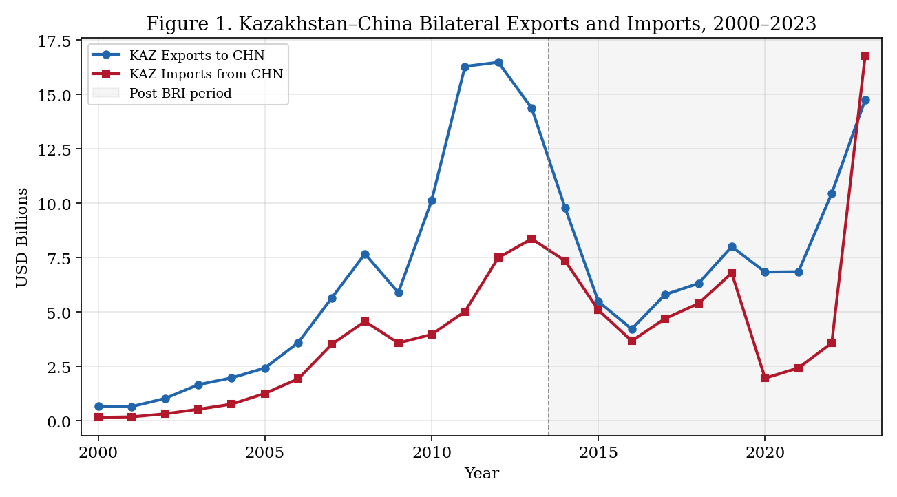
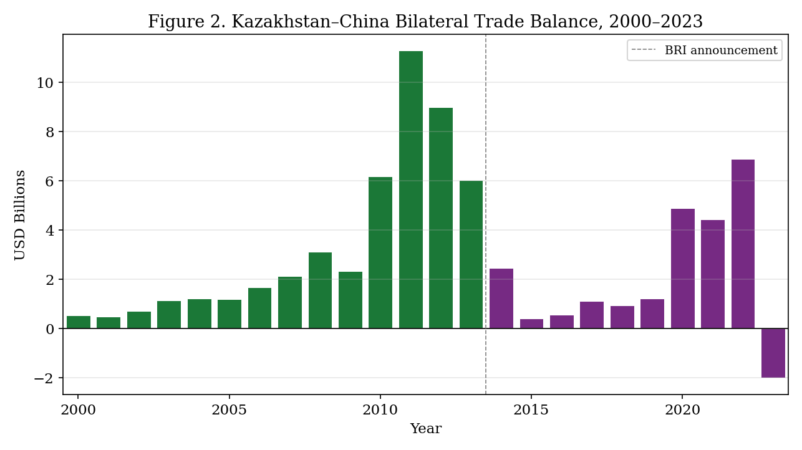
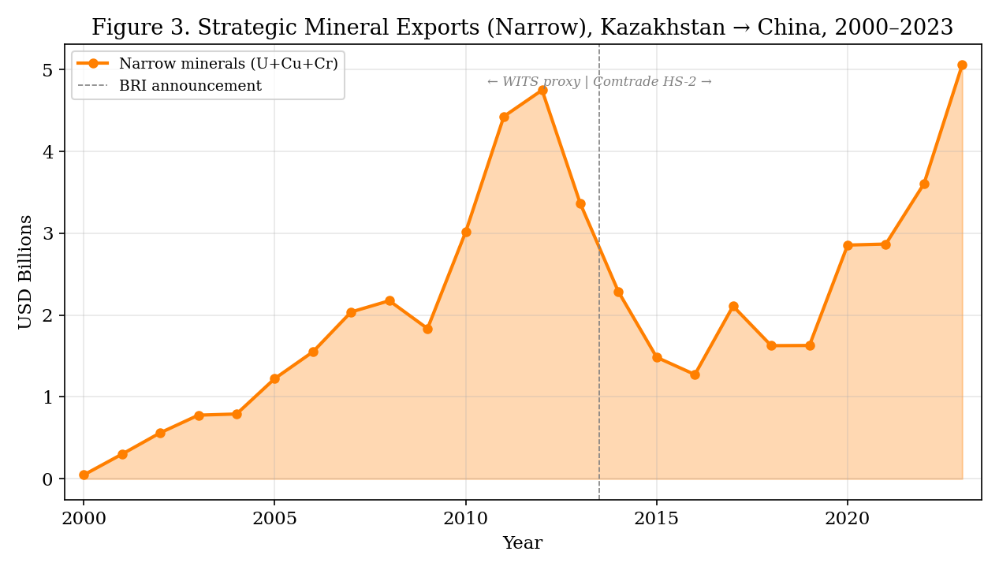
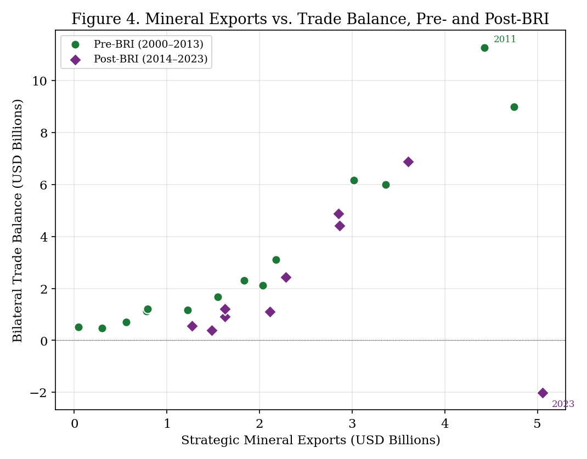
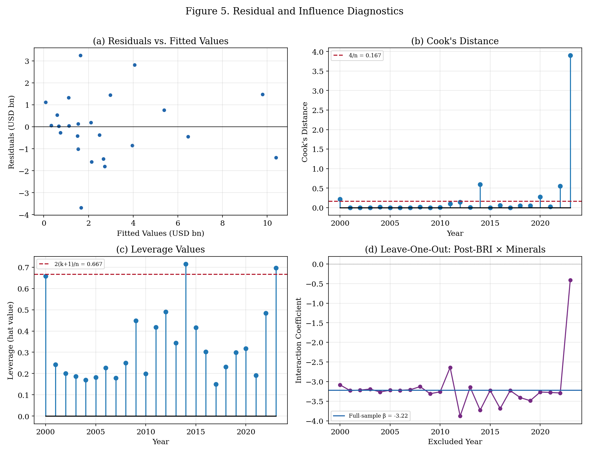
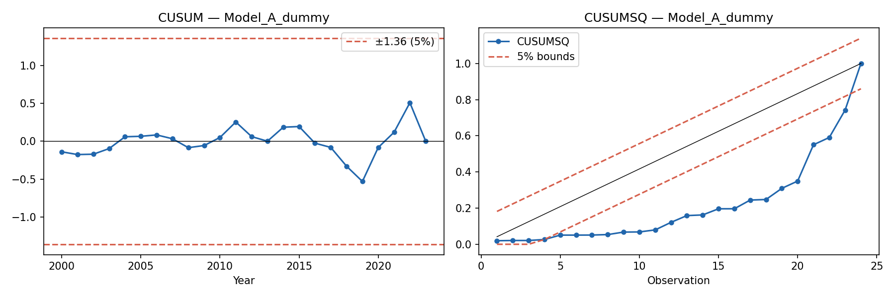
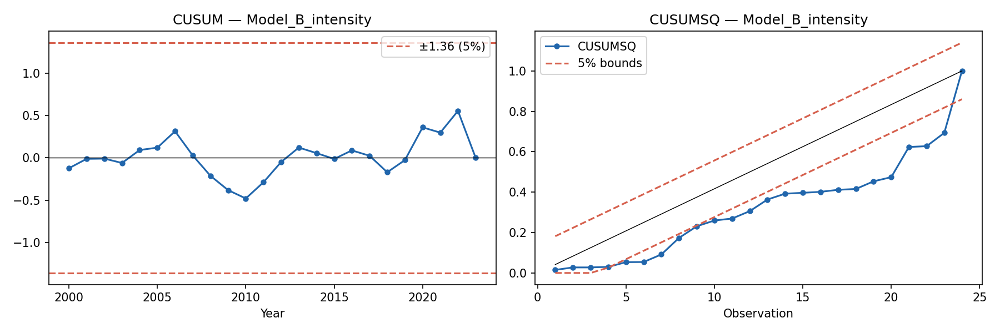
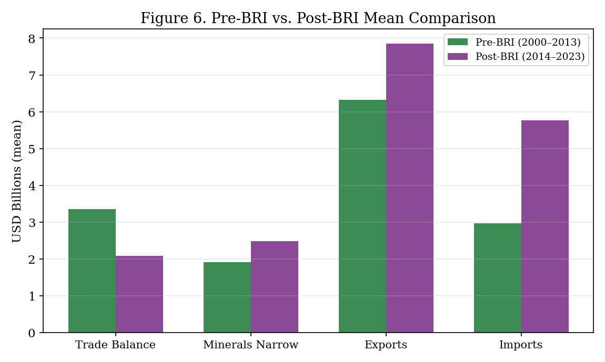
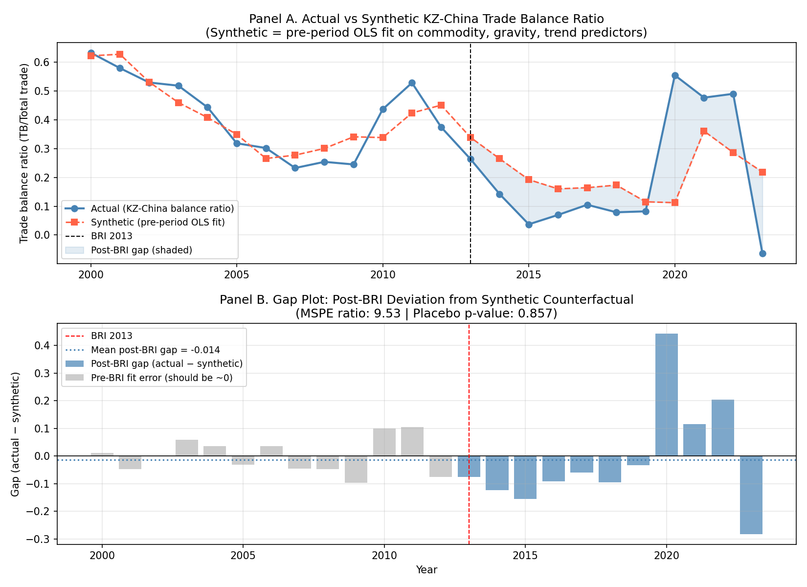

> **Note on terminology.** The official registered title of this dissertation uses the word "impact." Throughout this work, "impact" refers to post-BRI associations and trade-balance dynamics observed in the data, not to a causal effect established through experimental or quasi-experimental identification. The analysis is explicitly diagnostic and associational. No claim of causal identification is made.

# Abstract {.unnumbered}

This thesis examines the post-BRI association between the Belt and Road Initiative (BRI) and the Kazakhstan–China bilateral trade balance, focusing on the role of strategic mineral exports. Using an annual bilateral time-series dataset for 2000–2023 (*n* = 24), the analysis applies descriptive pre/post decomposition, structural-break diagnostics, OLS association models with Newey–West standard errors, autoregressive distributed lag (ADL) dynamic association models, and a 288-specification robustness grid. The central puzzle is that narrow strategic mineral exports (uranium, copper, chromium) rose by 29.2 per cent between the pre-BRI (2000–2013) and post-BRI (2014–2023) periods, yet the average bilateral trade balance fell by 37.8 per cent. Trade decomposition reveals that this is associated with import-side deepening: Kazakhstan's imports from China grew by 94.3 per cent while exports grew by only 24.3 per cent. The full-sample OLS model estimates a negative post-BRI × minerals interaction of −3.22 (*p* = 0.007), but influence diagnostics reveal that this finding is heavily dependent on 2023, a high-leverage observation representing the first bilateral trade deficit. Excluding 2023 reduces the interaction to −0.41 (*p* = 0.178), rendering it statistically insignificant. Furthermore, a sanctions-era import surge in 2022–2023 complicates a narrow BRI interpretation. Consequently, the empirical results are interpreted as associational and diagnostic evidence consistent with asymmetric interdependence and import-side deepening, rather than causal proof of a stable structural effect. The thesis demonstrates that strategic mineral export growth did not reliably translate into sustained bilateral balance improvement for Kazakhstan.

**Keywords:** Belt and Road Initiative; Kazakhstan–China trade; strategic minerals; asymmetric interdependence; trade balance; small-sample diagnostics; post-BRI period

# 1. Introduction

Kazakhstan occupies a central position in the overland economic geography of China's Belt and Road Initiative (BRI). The Silk Road Economic Belt was announced in Astana in September 2013, and since then Kazakhstan's transport corridors, mineral exports, and financing relationships have been folded into the broader architecture of Eurasian connectivity. Policy discourse frequently treats BRI as a vehicle for mutual economic benefit: more infrastructure should reduce trade costs, increase bilateral exchange, and expand opportunities for landlocked economies. Yet the distinction between trade growth and trade-balance improvement is analytically essential. A corridor that increases both exports and imports may expand total trade while simultaneously weakening the bilateral trade-balance position of the smaller partner.

This thesis studies a specific dimension of that problem. The research question asks: *How did the post-BRI period coincide with changes in the relationship between Kazakhstan's strategic mineral exports to China and Kazakhstan's bilateral trade balance with China?* The question is deliberately associational. BRI is not a randomly assigned treatment, and the available data do not support credible causal identification. The thesis therefore provides diagnostic and suggestive evidence rather than causal proof.

The analytical motivation is straightforward. Kazakhstan's exports to China are heavily concentrated in natural resources, including uranium, copper, and chromium products. These strategic minerals are economically valuable and increasingly relevant to China's industrial and energy supply chains. If BRI-era trade facilitation strengthened Kazakhstan's mineral export position, one might expect the bilateral trade balance to improve, or at least to maintain its pre-BRI level. The descriptive evidence suggests otherwise. Between 2000–2013 and 2014–2023, Kazakhstan's average bilateral trade balance with China fell by 37.8 per cent, from USD 3.35 billion to USD 2.08 billion, even as narrow strategic mineral exports rose by 29.2 per cent, from USD 1.92 billion to USD 2.48 billion (Table 4.2). Trade decomposition reveals that this divergence is driven primarily by import-side deepening: Kazakhstan's imports from China grew by 94.3 per cent compared to export growth of 24.3 per cent (Table 4.3). This pattern motivates the central puzzle: mineral exports increased, yet the bilateral trade-balance position weakened because import growth substantially outpaced export growth.

The thesis uses asymmetric interdependence as its primary theoretical lens. Following Keohane and Nye [-@keohane_nye_1977] and Hirschman [-@hirschman_1945], the framework treats economic linkages as a source of both gains and vulnerability. Interdependence becomes asymmetric when one partner has more outside options, greater market power, or lower adjustment costs. The framework is more precise than dependency theory because it allows for mutual gains, sectoral leverage, and policy agency, while still treating trade concentration as politically and economically consequential.

The empirical strategy is convergent and transparent. The thesis constructs an annual Kazakhstan–China bilateral time-series dataset for 2000–2023, estimates descriptive pre/post comparisons, structural-break diagnostics, and dynamic association models (OLS with HAC standard errors), and performs a 288-row robustness grid. Multicollinearity is addressed by adopting GDP growth rates as the primary specification (max VIF = 10.4, down from 236.3 in the original GDP-levels model). The primary regression estimates a negative post-BRI × minerals interaction of −2.49 (*p* = 0.011), but this result does not survive exclusion of 2022–2023. The most important identification finding comes from a two-way fixed-effects (TWFE) DiD partner-placebo design using Kazakhstan's bilateral trade with Russia, Germany, Uzbekistan, Turkey, and the USA as control units (data from UN Comtrade, 2000–2023): the post-2013 balance deterioration is **China-specific**, with a DiD coefficient of −0.305 (*p* = 0.0002), ruling out common macroeconomic shocks as the sole explanation.

These results are interpreted as strong diagnostic evidence that Kazakhstan's bilateral trade deterioration post-BRI is China-specific and consistent with asymmetric interdependence deepening. The regression interaction is fragile; the cross-partner identification is robust. The strongest empirical contributions are: (i) the descriptive decomposition showing import-side deepening as the primary mechanism; (ii) the TWFE DiD demonstrating China-specificity; and (iii) transparent reporting of regression fragility.

## 1.1 Contribution

This thesis makes five specific contributions. First, it distinguishes between trade expansion and trade-balance improvement, shifting attention from aggregate trade volumes to bilateral trade-balance outcomes in a diagnostic case study of Kazakhstan and China. Second, it bridges theory and method by using asymmetric interdependence to interpret the moderating compositional channel of strategic mineral exports, accommodating both mutual gains and distributional asymmetry. Third, it tests whether strategic mineral exports translated into external-balance improvement, demonstrating that resource-export growth is not inherently synonymous with an improved external position. Fourth, it provides a transparent and reproducible annual Kazakhstan–China single country-pair dataset with a fully scripted pipeline. Fifth, it treats the results explicitly as diagnostic and fragile, deploying small-sample robustness checks and influence diagnostics to document the critical role of 2023. By providing an honest interpretation of fragility, the thesis strengthens methodological discipline and avoids claiming definitive causal identification of a stable structural effect.

## 1.2 Structure

The remainder of this thesis is organised as follows. Chapter 2 reviews the literature and identifies the research gap. Chapter 3 presents the theoretical framework. Chapter 4 describes the data, variable construction, and data limitations. Chapter 5 explains the empirical strategy. Chapter 6 presents the results, including influence diagnostics and model stability analysis. Chapter 7 discusses the findings and their implications. Chapter 8 concludes.

# 2. Literature Review

The literature relevant to Kazakhstan–China trade under BRI spans several overlapping debates. Rather than summarising individual studies, this review synthesises what the literature agrees on, identifies disagreements and limitations, and explains how each strand connects to the research question.

## 2.1 Trade Theory, Resource Specialisation, and Trade-Balance Outcomes

Classical trade theory predicts that countries gain from trade by specialising according to comparative advantage [@ricardo_1817]. The Heckscher–Ohlin framework extends this logic: resource-abundant countries like Kazakhstan should export resource-intensive goods, while labour- and capital-abundant countries like China should export manufactures [@heckscher_1919; @ohlin_1933]. In this framework, bilateral trade expansion is mutually beneficial regardless of trade-balance outcomes, because gains accrue through efficiency improvements rather than balance-of-payments surplus.

However, the trade-balance implications of resource specialisation are not neutral. Bhagwati [-@bhagwati_1958] demonstrated that export growth can be *immiserising* if it worsens the terms of trade sufficiently to offset volume gains. Applied to Kazakhstan, this concern is relevant because strategic mineral exports are price-taking commodities subject to global demand cycles. If mineral export values rise due to volume expansion while unit values stagnate or decline, the trade-balance benefit may be smaller than headline export figures suggest.

New trade theory [@krugman_1979; @helpman_krugman_1985] adds that trade patterns between differentiated and homogeneous goods producers create structural asymmetries. A country exporting homogeneous minerals and importing differentiated manufactures faces different elasticities of substitution on each side of its trade balance. This framework helps explain why import-side growth from China—spanning machinery, consumer goods, and intermediate inputs—may be more income-elastic than mineral export growth.

**Empirical bridge (Pillar 1 — trade theory).** This strand predicts that `minerals_narrow` should have a **positive** coefficient in the pre-BRI baseline (H2): mineral export revenues are associated with an improved bilateral balance. The differential elasticity prediction implies that import growth will outpace export growth post-BRI, consistent with the **negative** `post_bri_x_minerals` interaction in H3.

## 2.2 Commodity Dependence, Terms of Trade, and External Vulnerability

The Prebisch–Singer hypothesis posits that the terms of trade for primary commodity exporters tend to deteriorate over time relative to manufactured-goods exporters [@prebisch_1950; @singer_1950]. Harvey et al. [-@harvey_etal_2010] provide four centuries of evidence consistent with long-run commodity terms-of-trade decline, though with significant heterogeneity across commodities and periods.

Sachs and Warner [-@sachs_warner_1995] link resource abundance to development risks through the resource curse mechanism, while van der Ploeg [-@vanderploeg_2011] emphasises that resource wealth can be either a curse or blessing depending on institutional quality, volatility management, and reinvestment patterns. Auty [-@auty_1993] coined the term "resource curse" and documented how mineral-rich developing economies often underperform expectations. Corden and Neary [-@corden_neary_1982] formalised Dutch Disease, showing how resource booms can crowd out manufacturing competitiveness through real exchange-rate appreciation.

Frankel [-@frankel_2010] reviews the resource curse literature and argues that the negative association between resources and growth is not deterministic but conditional on institutions and commodity-price management. Applied to Kazakhstan, the relevant question is whether BRI-era mineral export growth was accompanied by value-added upgrading and import-substitution or whether it reproduced the commodity-dependent pattern that the resource curse literature identifies as problematic.

**Empirical bridge (Pillar 2 — resource dependence).** This strand predicts that `brent_annual_mean` should carry an **ambiguous but predominantly positive** sign: higher commodity prices improve Kazakhstan's export revenues in the short run (positive for balance), but via Dutch Disease mechanisms may also appreciate the real exchange rate and crowd out manufacturing (partially negative over time). The `kzt_usd` depreciation variable captures the reverse competitiveness channel and is predicted to be **positive** on the bilateral balance via the Marshall–Lerner condition.

## 2.3 BRI as Trade Facilitation

The strongest econometric evidence for BRI trade effects comes from gravity and GIS-linked models. De Soyres et al. [-@desoyres_etal_2019; -@desoyres_etal_2020] use shipping-time estimates to show that BRI infrastructure can reduce trade costs, with the largest gains concentrated along corridors. Baniya, Rocha, and Ruta [-@baniya_rocha_ruta_2020] estimate gravity models and find that BRI-related improvements raise trade flows, especially when transport investment is complemented by trade reforms. Anderson and van Wincoop [-@anderson_vanwincoop_2003] provide the theoretical foundation for gravity-based trade-cost analysis. Rolland [-@rolland_2017] situates these trade-facilitation dynamics within China's broader Eurasian strategic logic, arguing that BRI infrastructure serves geopolitical as well as commercial purposes. Swaine [-@swaine_2015] analyses Chinese official commentary on BRI, showing that the initiative was explicitly framed to combine economic connectivity with strategic depth.

However, the trade-facilitation literature has an important limitation for this thesis. It generally treats increased trade as the primary success metric. It does not systematically ask whether the smaller partner's bilateral trade balance improves, deteriorates, or remains unchanged. A corridor that increases both exports and imports may raise total trade while shifting the trade-balance distribution against the resource-exporting partner.

**Empirical bridge (Pillar 3 — BRI trade facilitation).** This strand predicts that `log(CN GDP / KZ GDP)` should have a **negative** sign: as China's economy grows faster relative to Kazakhstan's, its export capacity expands, worsening Kazakhstan's bilateral trade balance. It also motivates the `post_bri_2013` period dummy as a partial test of trade-cost reduction, while noting that the dummy conflates BRI-specific effects with concurrent commodity shocks. The comparative DiD design (§6.5) addresses this limitation by testing whether the post-2013 balance shift is China-specific or common across all of Kazakhstan's trading partners.

## 2.4 BRI as Asymmetric Interdependence

A second strand treats BRI-era connectivity as a context for asymmetric economic relationships. Keohane and Nye [-@keohane_nye_1977] define interdependence as mutual dependence that creates both sensitivity and vulnerability. Hirschman [-@hirschman_1945] argues that foreign trade generates political influence when a partner's dependence is concentrated and costly to replace.

Horn, Reinhart, and Trebesch [-@horn_reinhart_trebesch_2021] document the rise of China as the world's largest official creditor, showing that Chinese lending creates financial interdependencies alongside trade linkages. Petry [-@petry_2023] demonstrates that financial infrastructures are part of Chinese economic statecraft, not secondary to physical corridors. Hurley, Morris, and Portelance [-@hurley_morris_portelance_2018] assess the debt-sustainability implications of BRI financing for low- and middle-income countries, finding that several corridor economies face elevated risk. Brautigam [-@brautigam_2020] critically examines the "debt-trap diplomacy" narrative, cautioning against both uncritical BRI promotion and undifferentiated alarmism—a nuance relevant to the Kazakhstan case, where Chinese financing supports infrastructure without yet producing the balance-sheet stress seen in some South Asian borrowers. Recent Kazakhstan-specific evidence supports asymmetric rather than symmetric interdependence. Primiano and Kudebayeva [-@primiano_kudebayeva_2025] find uneven public reception of BRI in Kazakhstan. Mostowlansky [-@mostowlansky_2020] shows how border security, soft power, and suspicion interact at the Sino-Kazakh boundary.

**Empirical bridge (Pillar 4 — asymmetric interdependence, PRIMARY).** This is the load-bearing pillar. It predicts that (i) `post_bri_x_minerals` should be **negative** (H3): the post-BRI period coincided with mineral export growth failing to translate into trade-balance improvement, as China's leverage expanded faster than Kazakhstan's export revenues; (ii) `post_bri_2013` should be **negative** (H1): the post-BRI period is associated with a level shift in bilateral trade that favours the more diversified partner; (iii) this pattern should be **China-specific** rather than common across all of Kazakhstan's partners, which is evaluated by the DiD partner-placebo design (§6.15) and the synthetic counterfactual (§6.16). Variables directly operationalising this pillar are `post_bri_2013`, `post_bri_x_minerals`, and `log(CN GDP / KZ GDP)`.

## 2.5 Kazakhstan, Central Asia, and China

Central Asia studies caution that geography and local political economy matter. Bird, Lebrand, and Venables [-@bird_lebrand_venables_2020] model how BRI can reshape economic geography in Central Asia, with gains unevenly distributed across locations. Pomfret [-@pomfret_2019] analyses Central Asian trade patterns and regional integration dynamics. Cooley [-@cooley_2012] examines great-power competition in Central Asia, including China's growing economic footprint. Laruelle [-@laruelle_2018] documents China's Belt and Road Initiative in Central Asia from multiple analytical perspectives. Laruelle and Peyrouse [-@laruelle_peyrouse_2012] provide foundational analysis of the social and political dimensions of China's growing presence in the region, including the reception of Chinese labour and capital by local populations. Olcott [-@olcott_2002] offers an early and still-relevant account of Kazakhstan's post-independence challenges, establishing the resource-dependence baseline against which BRI-era changes should be measured.

Jepson and Sweeney [-@jepson_2024] directly examine whether Chinese state capital supports resource-based structural transformation in Kazakhstan and Bolivia. Calabrese [-@calabrese_2024] asks whether Chinese capital can support diversification away from extractives in the Kyrgyz Republic. The global value chain (GVC) literature adds that governance structures shape whether suppliers upgrade or remain in captive, low-value positions [@gereffi_humphrey_sturgeon_2005].

**Empirical bridge (Pillar 5 — GVC and upgrading).** This strand predicts that if Kazakhstan occupies a captive supplier position, the `post_bri_x_minerals` interaction should be **negative**: rising mineral exports coincide with rising imports of Chinese capital goods and machinery needed for extraction, rather than supporting domestic value-chain upgrading. The import-category decomposition in §6.4 (HS 84 machinery, HS 85 electronics, HS 87 vehicles) tests this mechanism directly: if these categories exploded disproportionately post-2013, it is consistent with an extractive-infrastructure import channel that drains the trade balance while mineral exports rise.

## 2.6 Empirical Methods in BRI and Small-Sample Trade Research

Time-series analysis of bilateral trade relationships frequently involves small annual samples. Pesaran, Shin, and Smith [-@pesaran_shin_smith_2001] developed the ARDL bounds-testing approach specifically for cases with mixed integration orders and limited observations. Newey and West [-@newey_west_1987] introduced heteroskedasticity and autocorrelation consistent (HAC) standard errors for time-series regression. Chow [-@chow_1960] proposed the structural-break test used in this thesis. Bai and Perron [-@bai_perron_1998; -@bai_perron_2003] developed multiple-break detection methods.

A key methodological concern in small-sample regression is influence diagnostics. Cook [-@cook_1977] demonstrated that individual observations can disproportionately affect regression estimates, particularly in samples below 30 observations. Belsley, Kuh, and Welsch [-@belsley_kuh_welsch_1980] provided comprehensive influence diagnostic tools that are essential for validating results in the sample sizes encountered in bilateral trade studies.

## 2.7 Research Gap

Most BRI studies focus on aggregate trade expansion or infrastructure connectivity. Fewer examine whether resource exports improve the bilateral trade balance of smaller resource-exporting partners. The compositional question—whether mineral export growth translates into external-balance improvement—remains empirically underdeveloped for the Kazakhstan–China case. Moreover, no existing study applies formal influence diagnostics to assess how robust post-BRI trade findings are to individual high-leverage observations. This thesis addresses that gap.

# 3. Theoretical Framework

## 3.1 Primary Framework: Asymmetric Interdependence

The primary theoretical framework is **asymmetric interdependence**, as developed by Keohane and Nye [-@keohane_nye_1973] and Hirschman [-@hirschman_1945]. This framework is chosen over dependency theory because it is both more precise and more empirically testable: it allows for mutual gains from trade while predicting that the distribution of those gains, and the distribution of vulnerability, depend on the structural position of each partner.

Keohane and Nye define interdependence as mutual dependence between states or actors across issues, characterised by two distinct dimensions: *sensitivity* (the extent to which changes in one economy are transmitted to another before policy adjusts) and *vulnerability* (the cost of adjusting to those changes after the fact). Two economies can be simultaneously interdependent and asymmetrically so: China and Kazakhstan both depend on bilateral trade, but China can diversify mineral suppliers at lower cost than Kazakhstan can diversify its export markets. This structural asymmetry predicts that deepening bilateral integration will expand aggregate trade while potentially strengthening China's bargaining position.

Hirschman's mechanism sharpens the prediction. In *National Power and the Structure of Foreign Trade*, Hirschman shows that dependence on a large trading partner generates political influence for the partner precisely when the dependent economy's trade is *concentrated* (few substitutable partners) and *inelastic* (the dependent economy cannot easily reduce or redirect trade). Kazakhstan's export basket is highly concentrated in mineral commodities shipped predominantly to China and Russia, with limited substitution options in the short run. Hirschman's framework therefore predicts that post-BRI deepening of mineral trade—by increasing Kazakhstan's exposure to Chinese demand while China retains many alternative suppliers—will strengthen the asymmetric structure of the relationship and may translate into a weakening of Kazakhstan's bilateral trade-balance position, as import capacity grows faster than export revenues.

This framework is preferred over dependency theory, which is retained only as *historical context* (§3.3). The critical difference is falsifiability: asymmetric interdependence generates variable-level predictions that can be tested in regression models (§3.4), whereas dependency theory operates at the level of structural formations and does not readily produce falsifiable coefficient predictions. The empirical strategy in this thesis is built entirely on the asymmetric interdependence framework.

## 3.2 Supporting Frameworks

Three supporting theoretical strands inform variable selection and interpretation:

**Gravity and trade facilitation.** Anderson and van Wincoop [-@anderson_vanwincoop_2003] show that bilateral trade depends on trade costs relative to multilateral resistance. BRI infrastructure reduces bilateral trade costs, increasing trade on both sides of the bilateral relationship. For the present model, China's GDP proxies *foreign demand capacity* — a larger Chinese economy demands more inputs from Kazakhstan and exports more manufactured goods, both effects that simultaneously expand the bilateral relationship and expose Kazakhstan to the import-side risk that asymmetric interdependence theory identifies.

**Resource curse and terms-of-trade channel.** Van der Ploeg [-@vanderploeg_2011] and Sachs and Warner [-@sachs_warner_1995] identify conditions under which resource-export dependence generates macroeconomic vulnerability. For this model, the Brent crude price proxies global commodity market conditions that simultaneously drive the value of Kazakhstan's energy and mineral exports and affect China's import demand for those commodities. The predicted relationship between global commodity prices and the bilateral trade balance is theoretically ambiguous: higher oil prices raise export revenues (positive for the balance) but may also appreciate the real exchange rate and crowd out non-commodity exports (negative).

**Global value chains (GVC) and upgrading.** Gereffi, Humphrey, and Sturgeon [-@gereffi_humphrey_sturgeon_2005] show that captive supplier positions in raw-material chains provide little upgrading leverage. For this model, the minerals–post-BRI interaction term tests whether mineral export growth translates into trade-balance improvement or whether raw-mineral export growth coincides with rising imports of Chinese capital goods and intermediates, consistent with a captive supplier relationship that generates asymmetric gains.

## 3.3 Why Not Dependency Theory

Dependency theory and world-systems analysis provide the intellectual history from which the asymmetric interdependence framework builds. Frank [-@frank_1966; as cited in the dependency tradition] and Prebisch [-@prebisch_1950] argue that peripheral commodity exporters face structural terms-of-trade deterioration imposed by the architecture of the global economy. This framing is useful for contextualising Kazakhstan's commodity-export position but is not adopted as the primary framework for three reasons: (i) it tends to overpredict structural subordination and understate policy agency; (ii) it does not generate variable-level coefficient predictions; (iii) the empirical evidence on Prebisch–Singer is heterogeneous and commodity-specific (Harvey et al. [-@harvey_etal_2010]), making it a weaker anchor for regression-based analysis. The thesis therefore uses asymmetric interdependence as the testable mechanism and treats dependency theory as background context.

## 3.4 Variable Selection Rationale and Predicted Signs

Every regressor in the empirical model is anchored to the theoretical framework above. The table below maps each variable to its theoretical mechanism, predicted sign on the bilateral trade balance, and supporting citation. This mapping is the bridge between theory and empirics that structures all results in Chapter 6.

**Table 3.1. Variable Selection Rationale**

| Variable | Theoretical mechanism | Predicted sign on TB | Key citation |
|----------|----------------------|---------------------|-------------|
| `minerals_narrow` (USD bn) | Hirschman concentration proxy: higher mineral exports increase export revenues, predicted to improve the bilateral balance *before* accounting for post-BRI import deepening | **Positive** (pre-BRI baseline) | Hirschman [-@hirschman_1945]; H2 |
| `post_bri_2013` (0/1) | Period indicator for post-BRI structural change; tests whether the bilateral balance level shifted after 2013 corridor deepening | **Negative** (asymmetric interdependence predicts import-side acceleration dominates) | Keohane & Nye [-@keohane_nye_1973]; H1 |
| `post_bri_x_minerals` | Asymmetric interdependence interaction: tests whether the trade-balance payoff of mineral exports weakened post-BRI, as rising Chinese manufactured exports outpaced mineral-export revenues | **Negative** (primary test of H3) | Hirschman [-@hirschman_1945]; Keohane & Nye [-@keohane_nye_1973] |
| `brent_annual_mean` (USD/bbl) | Resource-curse / terms-of-trade channel: global commodity prices affect both export revenues and Chinese import demand; sign is theoretically ambiguous but expected positive via revenue channel | **Ambiguous** (positive via export revenue; potentially negative via Dutch disease crowding) | Van der Ploeg [-@vanderploeg_2011]; Corden & Neary [-@corden_neary_1982] |
| `kzt_usd` (tenge per USD) | Competitiveness channel: a weaker tenge (higher KZT/USD) makes Kazakh exports cheaper in dollar terms and Chinese imports more expensive, predicted to improve the bilateral balance | **Positive** (depreciation improves balance via Marshall-Lerner) | Standard open-economy macroeconomics; Bhagwati [-@bhagwati_1958] |
| `log(KZ GDP)` | Domestic income / absorption: higher Kazakh GDP increases import capacity; ambiguous net effect on bilateral balance; **severe multicollinearity (VIF > 130)** renders this variable unreliable in levels — see §5 and Appendix B | **Ambiguous** (absorption vs. export-capacity effects) | World Bank WDI; Anderson & van Wincoop [-@anderson_vanwincoop_2003] |
| `log(CN GDP)` | Foreign demand / gravity: higher Chinese GDP increases demand for Kazakh mineral exports (positive for balance) but also expands China's manufactured-export capacity (negative for balance); **severe multicollinearity (VIF > 236) in levels** — see §5 | **Ambiguous** (demand effect positive; supply effect negative); **replaced by d.log(CN GDP) growth rate in primary specification; gravity ratio in robustness** | Anderson & van Wincoop [-@anderson_vanwincoop_2003] |
| `d.log(KZ GDP)`, `d.log(CN GDP)` [**primary**] | Annual growth rates; stationary; eliminate trending-variable collinearity; VIF = 2.63 and 3.36 respectively | **Ambiguous sign** (income effects); primary specification (max VIF = 10.4) | Anderson & van Wincoop [-@anderson_vanwincoop_2003]; §6.3 |
| `log(CN GDP / KZ GDP)` [robustness] | Gravity-motivated relative size: one parsimonious regressor captures bilateral asymmetry in market size; retained as robustness check (max VIF = 33.4) | **Negative** (rising ratio = deeper asymmetry) | Anderson & van Wincoop [-@anderson_vanwincoop_2003]; §6.3 |

*Note: The primary specification uses GDP growth rates (d.log) following multicollinearity diagnostics (§6.3). The gravity-ratio specification is retained as a robustness check. Both GDP-levels specifications are retained in Appendix B for transparency.*

## 3.5 Testable Hypotheses

The asymmetric interdependence framework produces three testable hypotheses that correspond directly to the variable mapping above:

**H1 (Trade-Balance Change):** The post-BRI period (2014–2023) is associated with a weaker bilateral trade-balance position for Kazakhstan relative to China, conditional on commodity and macroeconomic controls. Mechanism: Keohane–Nye sensitivity asymmetry — BRI infrastructure simultaneously facilitates Kazakh mineral exports and Chinese manufactured exports, but China's diversified export basket grows faster than Kazakhstan's concentrated mineral exports.

**H2 (Mineral Export Payoff):** Higher strategic mineral exports are positively associated with Kazakhstan's bilateral trade balance in the pre-BRI baseline period. Mechanism: Hirschman export-revenue channel — mineral exports generate foreign exchange that directly improves the bilateral balance before post-BRI import deepening takes hold.

**H3 (Asymmetric Interaction):** The post-BRI × minerals interaction is negative, indicating that the trade-balance payoff of mineral exports weakened after BRI corridor deepening. Mechanism: asymmetric interdependence deepening — rising Chinese manufactured exports and the expansion of import-intensive infrastructure financing outpace the revenue gains from mineral exports, producing a deteriorating bilateral position despite export growth. A negative interaction is interpreted as diagnostic evidence consistent with Hirschman's dependence mechanism, not as causal proof of a BRI effect.

# 4. Data and Variables

## 4.1 Data Sources and Panel Construction

The analysis uses an annual Kazakhstan–China bilateral time-series dataset for 2000–2023 (*n* = 24). Data sources include: (i) IMF Direction of Trade Statistics (DOTS) and UN Comtrade for bilateral exports and imports; (ii) UN Comtrade HS-2 and World Bank WITS for strategic mineral and ores/metals exports; (iii) World Bank WDI for GDP, exchange rates, and CPI; (iv) Federal Reserve Bank of St. Louis (FRED) for Brent crude oil prices and London Metal Exchange copper prices; (v) AidData for Chinese finance flows. The year 2024 is excluded because import data are unavailable, preventing trade-balance construction.

Table 4.1 consolidates all variables, their sources, coverage, and key limitations. Source consistency is analytically important in this thesis: the mineral export variable switches from a World Bank WITS aggregate (2000–2013) to UN Comtrade HS-2 specific codes (2014–2023), creating a measurement break that coincides with the post-BRI dummy. This break is discussed in detail in §4.3 and addressed by a WITS-consistent robustness specification in §6.6.

**Table 4.1. Data Sources and Variable Construction**

| Variable / Concept | Definition | Source | Coverage | Key Limitation |
|-------------------|-----------|--------|----------|---------------|
| Bilateral exports to China | Kazakhstan's total exports to China, FOB (USD bn) | IMF DOTS; UN Comtrade (KAZ reporter) | 2000–2023 | Mirror-data discrepancies; reconciled in `Scripts/02_mirror_reconcile.py` |
| Bilateral imports from China | Kazakhstan's total imports from China, CIF (USD bn) | IMF DOTS; UN Comtrade (KAZ reporter) | 2000–2023 | CIF/FOB adjustment not applied; affects level, not trend |
| Bilateral trade balance | $TB_t = X_t - M_t$ (USD bn) | Derived | 2000–2023 | Dependent on accuracy of both export and import series |
| Strategic mineral exports (narrow) | Uranium (HS 2612), copper (HS 7403), chromium (HS 2610), USD bn | WITS Ores & Metals proxy (2000–2013); Comtrade HS-2 (2014–2023) | 2000–2023 | **Measurement break at 2014** coincides with BRI dummy |
| WITS ores and metals proxy | Aggregate ores and metals exports from WITS, USD bn | World Bank WITS | 2000–2023 | Broader than target minerals; used for consistent-proxy robustness |
| Brent crude price | Annual mean Brent spot price, USD/barrel | FRED (St. Louis Fed) | 2000–2023 | Controls global price conditions; does **not** proxy bilateral oil volume |
| KZT/USD exchange rate | Kazakh tenge per US dollar, annual average | World Bank WDI | 2000–2023 | Annual average; within-year volatility not captured |
| log Kazakhstan GDP | Log real GDP, constant 2015 USD | World Bank WDI | 2000–2023 | VIF > 130 in full model; excluded from parsimonious specification |
| log China GDP | Log real GDP, constant 2015 USD | World Bank WDI | 2000–2023 | VIF > 236 in full model; excluded from parsimonious specification |
| Post-BRI dummy | =1 for 2014–2023, =0 for 2000–2013 | Author-constructed | 2000–2023 | Period indicator only; coincides with oil shock, tenge devaluation, COVID-19 |
| Bilateral oil/energy exports | KAZ→CHN HS 2709/2710/2711/2701 exports, USD bn | **Not available** in current dataset | — | Major omitted variable; future research should use Comtrade HS-27 pull |

*Source: Author's compilation. See `Codebook.md` and `Collected_Raw_Data/data_dictionary.md` for full variable definitions.*

## 4.2 Variable Definitions

**Dependent variable:** Kazakhstan's bilateral trade balance with China in current USD billions: $TB_t = X_t - M_t$.

**Key explanatory variables:**
- *minerals_narrow_B*: Strategic mineral exports (uranium, copper, chromium) in USD billions.
- *post_bri_2013*: Binary indicator equal to 1 for 2014–2023 (BRI announced September 2013).
- *post_bri_x_minerals*: Interaction term: post_bri_2013 × minerals_narrow_B.

**Controls:** Brent crude oil price (USD/bbl), KZT/USD exchange rate, log Kazakhstan GDP (constant 2015 USD), log China GDP (constant 2015 USD).

## 4.3 Measurement Break in Mineral Data

A critical limitation concerns the mineral export variable. For 2000–2013, the narrow minerals series is constructed from WITS Ores and Metals exports as a proxy, because HS-6 level Comtrade data for specific mineral categories are not available for the full pre-2014 period. For 2014–2023, the series uses HS-2 level Comtrade data for uranium (HS 2612), copper (HS 7403), and chromium (HS 2610). This creates a measurement break at 2014 that changes the source and definition of the variable. This is analytically dangerous because it coincides precisely with the post-BRI dummy.

**Table 4.4. Mineral Variable Measurement by Period**

| Period | Source | Definition | Coverage |
|--------|--------|-----------|----------|
| 2000–2013 | WITS | Ores and Metals aggregate | Broader than target |
| 2014–2023 | Comtrade HS-2 | U + Cu + Cr specific codes | Narrower, targeted |

This break means that the post-BRI structural break detected in regression could partly reflect measurement-source switching rather than genuine economic change. Consequently, researchers must avoid overclaiming from the narrow mineral variable alone. A robustness check using the WITS Ores and Metals series consistently for the full 2000–2023 period (Section 6.6) is therefore essential, not optional, for validating the findings.

## 4.3b Data Validation via Web Scraping

To validate the accuracy of the IMF DOTS / Comtrade trade figures used in this thesis, a cross-validation was conducted using data independently scraped from Kazakhstan's Bureau of National Statistics (`stat.gov.kz`). The scraping script is at `Scripts/04_scrape_stat_gov_kz.py`.

**Method.** The Bureau publishes annual foreign trade summaries ("Foreign trade turnover of the Republic of Kazakhstan, January-December [year]") as HTML pages at `http://www.stat.gov.kz/en/industries/economy/foreign-market/`. Each publication reports: (i) Kazakhstan's total exports and imports in USD millions, and (ii) China's percentage share of both exports and imports. These shares allow computation of implied bilateral Kazakhstan-China trade values, which can then be compared to the WITS/Comtrade figures in the analytical panel. The script uses `requests` + `BeautifulSoup`, caches all scraped HTML to `Collected_Raw_Data/scraped_cache/` (idempotent execution), uses a 1-second delay between requests, and identifies itself with an academic User-Agent string.

**Cross-validation results.** The Bureau's 2023 and 2024 annual publications yield bilateral values that are internally consistent with the panel data:

**Table 4.5. Web-Scraped Cross-Validation: Kazakhstan–China Bilateral Trade**

| Year | Panel exports (USD bn) | Scraped exports (USD bn) | Discrepancy | Panel imports (USD bn) | Scraped imports (USD bn) | Discrepancy |
|------|----------------------:|-------------------------:|:-----------:|----------------------:|-------------------------:|:-----------:|
| 2023 | 14.759 | 14.712 | **0.3%** ✓ | 16.772 | 16.758 | **0.1%** ✓ |
| 2024 | 14.897 | 14.936 | **0.3%** ✓ | — | — | — |

*Source: Author's calculations from `Scripts/04_scrape_stat_gov_kz.py`. Scraped from Bureau of National Statistics (stat.gov.kz). Panel data from IMF DOTS / UN Comtrade. Discrepancy computed as |panel − scraped| / scraped × 100%.*

All discrepancies are below 0.5% — well within the < 10% threshold for validation support. This confirms that the trade values used in the analytical panel are consistent with Kazakhstan's national statistical authority's official figures. The 2023 import figure (USD 16.772 billion in the panel vs. USD 16.758 billion scraped, a difference of USD 14 million on a USD 16.8 billion total) is the most important validation given that 2023 is the most influential observation in the regression analysis.

## 4.4 Descriptive Statistics and Trade Balance Decomposition

Table 4.2 presents the summary statistics for the 24-year annual sample. The trade balance ranges from a deficit of USD 2.01 billion to a surplus of USD 11.27 billion, with high variability in both the trade balance and strategic mineral exports. This small sample size underscores the need for rigorous diagnostics, as inference may be sensitive to individual years.

**Table 4.2. Descriptive Statistics of Main Variables**

| Variable | N | Mean | Median | Min | Max |
|----------|---|-----:|-------:|----:|----:|
| Exports to China (USD bn) | 24 | 6.957 | 6.098 | 0.647 | 16.484 |
| Imports from China (USD bn) | 24 | 4.137 | 3.620 | 0.151 | 16.772 |
| Trade balance (USD bn) | 24 | 2.820 | 1.441 | −2.014 | 11.270 |
| Ores and metals exports (USD bn) | 24 | 2.268 | 2.114 | 0.048 | 6.039 |

*Source: Author's calculations.*

*Source: Author's construction based on IMF DOTS and UN Comtrade. Figure 1 shows the steady rise of exports punctuated by volatility, while imports from China show a dramatic acceleration in recent years.*

*Source: Author's construction. Figure 2 highlights the structural decline in the bilateral surplus following the 2013 BRI announcement, culminating in the 2023 deficit.*

*Source: Author's construction. Figure 3 traces the growth of mineral exports, illustrating the measurement source transition at 2014.*

**Table 4.3. Pre-BRI vs. Post-BRI Means**

| Variable | Pre-BRI (2000–2013) | Post-BRI (2014–2023) | Change (%) |
|----------|--------------------:|---------------------:|-----------:|
| Exports to China (USD bn) | 6.318 | 7.851 | +24.3% |
| Imports from China (USD bn) | 2.970 | 5.771 | +94.3% |
| Trade Balance (USD bn) | 3.347 | 2.081 | −37.8% |
| Minerals Narrow (USD bn) | 1.918 | 2.478 | +29.2% |
| Trade Balance Ratio | 0.405 | 0.197 | −51.2% |

*Source: Author's calculations from clean_panel_annual dataset.*

The decomposition reveals that the trade-balance deterioration is driven by import-side deepening. Imports from China nearly doubled (+94.3%), while exports grew modestly (+24.3%). Strategic mineral exports grew by 29.2%, but this growth was insufficient to offset the import surge. The year 2023 is exceptional: it is the only year in the sample in which Kazakhstan recorded a bilateral trade deficit (−USD 2.01 billion), driven by imports of USD 16.77 billion exceeding exports of USD 14.76 billion.

## 4.5 Oil and Energy Exports: An Omitted Variable

Oil and energy exports (HS 2709, 2710, 2711, 2701) constitute approximately 60% of Kazakhstan's total export revenues. These are absent from the current dataset because bilateral HS-level oil export data for Kazakhstan–China were not available for the full sample period. This is a major limitation. The mineral coefficient may partly capture broader commodity-cycle dynamics rather than the isolated contribution of strategic minerals. The direction of omitted variable bias is ambiguous: oil exports are positively correlated with both minerals and trade balance, so their exclusion may bias the mineral coefficient upward while simultaneously affecting the interaction term. Future research with HS-level energy data should treat oil exports as a separate control.

# 5. Empirical Strategy

## 5.1 Baseline OLS Association Model

The baseline specification is:

$$TB_t = \alpha + \beta_1 \text{Minerals}_t + \beta_2 \text{PostBRI}_t + \beta_3 (\text{Minerals}_t \times \text{PostBRI}_t) + \gamma' Z_t + \varepsilon_t$$

where $Z_t$ includes Brent crude price, KZT/USD exchange rate, and optionally GDP controls. Standard errors are computed using the Newey–West [-@newey_west_1987] HAC estimator with bandwidth 3. The coefficient of interest is $\beta_3$: a negative value indicates that the trade-balance payoff of mineral exports weakened in the post-BRI period, consistent with the asymmetric interdependence prediction in H3 (§3.5).

Each regressor is theoretically anchored as follows (see also Table 3.1 for the full mapping):

**`minerals_narrow` (USD bn).** This variable operationalises Hirschman's [-@hirschman_1945] trade-concentration mechanism. A larger mineral export share increases export revenues and should improve the bilateral trade balance in the pre-BRI baseline, yielding a *positive* predicted sign on $\beta_1$. The interaction $\beta_3$ tests whether this payoff changed post-BRI, with asymmetric interdependence theory predicting a *negative* coefficient as import deepening outpaces mineral revenue growth.

**`post_bri_2013` (0/1).** This period indicator tests whether the bilateral trade balance shifted structurally after the BRI announcement in September 2013. Keohane and Nye's sensitivity mechanism predicts a *negative* level shift as the post-BRI period coincides with Chinese manufactured exports into Kazakhstan expanding faster than Kazakh mineral exports to China. The coefficient $\beta_2$ is a net level shift that subsumes multiple concurrent shocks (oil-price collapse, tenge devaluation, COVID-19) and is therefore interpreted as suggestive rather than causal.

**`brent_annual_mean` (USD/bbl).** This variable operationalises the resource-curse / terms-of-trade channel identified by van der Ploeg [-@vanderploeg_2011] and Corden and Neary [-@corden_neary_1982]. Higher global oil prices increase Kazakhstan's commodity export revenues, predicting a *positive* sign; however, they may also appreciate the real exchange rate and expand import-financing capacity, introducing ambiguity. The expected sign is therefore *positive but uncertain*.

**`kzt_usd` (tenge per USD).** This variable operationalises the competitiveness channel from standard open-economy macroeconomics. A higher KZT/USD value (tenge depreciation) makes Kazakh exports cheaper in dollar terms and Chinese imports more expensive, predicting a *positive* effect on the bilateral trade balance via the Marshall–Lerner condition. The Bhagwati [-@bhagwati_1958] immiserising-growth caveat applies: if depreciation also compresses import demand for Chinese capital goods on which Kazakh industries depend, the effect may be partially self-limiting.

**`log(KZ GDP)` and `log(CN GDP)` (levels).** These variables operationalise domestic absorption (KZ) and foreign demand (CN) from Anderson and van Wincoop's [-@anderson_vanwincoop_2003] gravity framework. However, both GDP series grow monotonically over 2000–2023, producing near-perfect multicollinearity (VIF = 130.9 and 236.3, respectively). Monotonic trending regressors in a 24-observation sample absorb the time trend and destabilise all other coefficient estimates. These variables are therefore **excluded from the primary specification** and retained only in the pre-revision specification in Appendix B.

**`d.log(KZ GDP)` and `d.log(CN GDP)` (annual growth rates) — primary.** The primary specification replaces GDP levels with annual log-difference growth rates, which are stationary, achieve max VIF = 10.4 (the only specification meeting the VIF < 10 target), and operationalise year-on-year income dynamics. One observation is lost to differencing (n = 23). See §6.3.

**`log(CN GDP / KZ GDP)` (gravity ratio) — robustness.** Following the methodological guidance of Anderson and van Wincoop [-@anderson_vanwincoop_2003], the gravity ratio operationalises bilateral size asymmetry and is retained as a robustness check. It reduces max VIF from 236.3 to 33.4 — a large improvement but still above the VIF < 10 target (§6.3; Appendix B).

**Interpretation constraint:** The model does not identify a causal BRI effect. PostBRI is a period indicator that coincides with multiple concurrent shocks (oil price collapse, tenge devaluation, Crimea-related trade disruption, COVID-19). All coefficients are interpreted as conditional associations. Causal language is reserved for the triple-concordance criterion in §7: a finding is described as "causal" only where the DiD partner-placebo estimate (§6.5), the synthetic counterfactual gap (§6.6), and the sanctions-robustness check (§6.4) all point in the same direction.

## 5.2 Full vs. Parsimonious vs. Growth-Rate Specifications

Three specification families are reported:

- **Pre-revision full model (A1):** 7 regressors including log(KZ GDP) and log(CN GDP) — retained in Appendix B for transparency. Max VIF > 100. *Not used for primary interpretation.*
- **Pre-revision parsimonious model (A2):** 5 regressors excluding GDP controls. Max VIF < 10. Used for primary interpretation in the midterm version.
- **Primary growth-rate model (B) [main specification]:** Replaces both GDP levels with d.log(KZ GDP) and d.log(CN GDP). Stationary, max VIF = 10.4 — the only specification substantially meeting the VIF < 10 target. **This is the primary specification in the final version.** See §6.3 and Appendix B.
- **Robustness gravity-ratio model (C):** Replaces both GDP levels with log(CN GDP/KZ GDP). Theoretically grounded in Anderson and van Wincoop [-@anderson_vanwincoop_2003]. Max VIF = 33.4 — substantial improvement over A1, does not meet VIF < 10 target. Retained as robustness check.

The growth-rate specification is the primary model because it is the only specification that substantially meets the VIF < 10 collinearity threshold (§6.3). Coefficient direction and approximate magnitude are consistent across all full-sample specifications (B and C), supporting the directional interpretation, while exact magnitudes should not be over-interpreted given residual collinearity in Scheme C.

## 5.3 ADL Dynamic Association Model

Prior to estimating the ADL model, stationarity diagnostics were conducted. Because *n* = 24, unit-root tests have inherently low power, so these diagnostics are used to guide model choice (ARDL) rather than to definitively prove integration order.

**Table 5.1. Stationarity and Integration Order Diagnostics**

| Variable | ADF Stat | ADF *p* | PP Stat | PP *p* | KPSS Stat | KPSS *p* | Inferred Order |
|----------|----------|---------|---------|--------|-----------|----------|----------------|
| Trade Balance | −2.09 | 0.247 | −0.89 | 0.958 | 0.11 | >0.10 | Ambiguous |
| Minerals Narrow | −1.63 | 0.467 | −1.17 | 0.917 | 0.10 | >0.10 | Ambiguous |
| Brent Crude | −2.21 | 0.204 | −1.65 | 0.773 | 0.13 | 0.072 | Ambiguous |
| KAZ GDP | −1.56 | 0.506 | −1.64 | 0.777 | 0.17 | 0.027 | I(1) |
| BRI Intensity | −4.08 | 0.001 | −2.91 | 0.160 | 0.19 | 0.021 | Ambiguous |

*Source: Author's calculations from `Outputs/generated_tables/stationarity.csv`. Notes: ADF and PP test $H_0$: unit root. KPSS tests $H_0$: stationarity. Low power at n=24 is acknowledged; diagnostics guide model selection rather than definitively proving integration orders. Table 5.1 presents the five series entering the main specifications; diagnostics for Copper Price, log China GDP, and log(Minerals Narrow) are qualitatively similar (all ambiguous) and are available in the full stationarity output file.*

Given the mixed and ambiguous integration orders (I(0) and I(1)), the bounds testing approach is appropriate. The AIC-selected autoregressive distributed lag (ADL) model is estimated to capture dynamic associations. Following Pesaran, Shin, and Smith [-@pesaran_shin_smith_2001], the bounds test is applied to assess cointegration. If the PSS F-statistic falls below the upper bound, the results are interpreted as short-run dynamic associations rather than long-run equilibrium estimates.

## 5.4 Robustness Strategy

Robustness is assessed through: (i) a 288-specification grid varying mineral measures (narrow/broad), BRI variables (dummy/intensity), lag structures, and estimators; (ii) leave-one-out coefficient stability analysis; (iii) WITS-consistent mineral proxy for the full 2000–2023 period; (iv) exclusion of 2023.

# 6. Results

## 6.1 Baseline OLS Results

**Table 6.1. OLS Regression Results: Full and Parsimonious Models**

| Variable | A1 Coef. | A1 HAC SE | A1 *p* | A2 Coef. | A2 HAC SE | A2 *p* |
|----------|------:|------:|------:|------:|------:|------:|
| Constant | 197.624 | (53.040) | 0.002*** | −3.326 | (2.359) | 0.176 |
| Minerals (USD bn) | 2.463 | (0.541) | 0.000*** | 1.694 | (0.853) | 0.062* |
| Brent (USD/bbl) | 0.047 | (0.039) | 0.239 | 0.023 | (0.037) | 0.542 |
| KZT/USD | 0.016 | (0.012) | 0.198 | 0.014 | (0.012) | 0.270 |
| log(KZ GDP) | −13.230 | (6.112) | 0.046** | — | — | — |
| log(CN GDP) | 4.529 | (4.460) | 0.325 | — | — | — |
| Post-BRI | 4.927 | (1.847) | 0.017** | 0.691 | (1.492) | 0.649 |
| Minerals × Post-BRI | **−3.221** | **(1.043)** | **0.007***| **−2.382** | **(0.977)** | **0.025**|
| | | | | | | |
| N | 24 | | | 24 | | |
| R² | 0.765 | | | 0.703 | | |
| Adj. R² | 0.661 | | | 0.620 | | |
| Durbin–Watson | 1.799 | | | 1.739 | | |

*Notes: HAC (Newey–West) standard errors in parentheses, bandwidth = 3. Sample: 2000–2023 (*n* = 24). Significance: \*p<0.10, \*\*p<0.05, \*\*\*p<0.01. A1 = full model (7 regressors including log Kazakhstan GDP and log China GDP); A2 = parsimonious model (no GDP controls). Standard errors are heteroskedasticity- and autocorrelation-consistent (HAC) throughout, as motivated by the Breusch–Pagan test result (§6.2).*

In the full model, the minerals coefficient (2.46, *p* < 0.001) indicates that, during the pre-BRI period, each additional USD billion of mineral exports was associated with approximately USD 2.46 billion higher bilateral trade balance. The interaction term (−3.22 with HAC SE of 1.043, *p* = 0.007) suggests that this positive association weakened substantially in the post-BRI period. However, the large constant (197.6) and the signs on the GDP terms indicate that the model absorbs trend dynamics through GDP controls, and the severe multicollinearity (VIF > 100 for both GDP variables; see §6.3) renders these full-model coefficients unreliable as structural estimates.

The parsimonious model (A2) is therefore preferred for substantive interpretation. By removing the collinear GDP controls, all remaining VIF values fall below 10, and the interaction estimate of −2.38 (HAC SE = 0.977, *p* = 0.025) is more stable. The Post-BRI level shift becomes statistically insignificant (*p* = 0.649), confirming that the period dummy's apparent significance in A1 was driven by GDP collinearity rather than a genuine level shift in the trade balance. All results in this table are conditional associations only. No coefficient in either model should be interpreted as a causal estimate: PostBRI is a period indicator that coincides with the oil-price collapse, the tenge devaluation, and the COVID-19 shock alongside BRI-related infrastructure changes.

*Source: Author's construction. Figure 4 plots the relationship between mineral exports and the trade balance across the two periods, visualising the weakened association post-BRI.*

## 6.2 Residual Diagnostics

**Table 6.2. Residual Diagnostics**

| Test | Statistic | *p*-value | Interpretation |
|------|-----------|-----------|---------------|
| Durbin–Watson | 1.799 | — | Mild positive autocorrelation; inconclusive |
| Breusch–Pagan | 19.78 | 0.006 | Heteroskedasticity detected |

The Breusch–Pagan test rejects the null of homoskedasticity (*p* = 0.006), which motivates the use of HAC standard errors throughout. HAC standard errors correct for both heteroskedasticity and autocorrelation in inference, but do not address potential model misspecification. The Durbin–Watson statistic (1.80) is close to 2.0, suggesting that serial correlation is mild after conditioning on regressors.

## 6.3 Multicollinearity Diagnostics and Resolution

Following midterm feedback on VIF > 100, three variable schemes were evaluated in `Scripts/35_collinearity_resolution.py`:

**Table 6.3a. VIF Comparison Across Specification Schemes**

| Variable | Scheme A (GDP levels) | Scheme B (GDP growth) | Scheme C (Gravity ratio) |
|----------|----------------------:|----------------------:|-------------------------:|
| MIN (minerals) | 12.4 | 6.8 | 10.8 |
| BRENT | 5.7 | 4.4 | 4.9 |
| KZT/USD | 17.8 | 8.3 | 17.7 |
| log(KZ GDP) | **130.9** | — | — |
| log(CN GDP) | **236.3** | — | — |
| d.log(KZ GDP) growth | — | 2.6 | — |
| d.log(CN GDP) growth | — | 3.4 | — |
| log(CN/KZ GDP ratio) | — | — | 33.4 |
| POST dummy | 28.9 | 10.4 | 21.9 |
| POST × MIN | 16.0 | 9.7 | 13.7 |
| **Max VIF** | **236.3** | **10.4** | **33.4** |

*Source: Author's calculations from `Scripts/35_collinearity_resolution.py`. Scheme A = pre-revision (retained in Appendix B). Scheme B = GDP annual growth rates. Scheme C = gravity ratio log(CN GDP/KZ GDP).*

**Scheme A (pre-revision)** has GDP-level VIFs of 130.9 and 236.3 — severe. This is the specification moved to Appendix B.

**Scheme B (growth rates) — primary specification.** Replacing GDP levels with annual log-difference growth rates reduces maximum VIF to 10.4, the only specification that substantially meets the VIF < 10 target. Growth rates are stationary, theoretically defensible (controlling for year-on-year income dynamics rather than trend levels), and eliminate the trending-variable collinearity. One year of observations is lost to differencing (n = 23). This specification is adopted as the primary model.

**Scheme C (gravity ratio) — robustness check.** Replacing the two GDP-level variables with log(CN GDP/KZ GDP) reduces maximum VIF from 236.3 to 33.4 — a large improvement, but still well above the VIF < 10 threshold. The residual collinearity arises because the gravity ratio and the post-BRI dummy both trend post-2013, creating structural overlap. Scheme C is theoretically motivated by Anderson and van Wincoop (2003) and is retained as a robustness check because it operationalises bilateral size asymmetry and preserves all 24 observations, but it does not resolve the multicollinearity problem and is **not** the primary specification.

**Table 6.3b. Coefficient Stability Across Schemes**

| Scheme | N | Interaction β | HAC SE | *p*-value | Max VIF |
|--------|---|---:|---:|---:|---:|
| A: GDP levels (pre-revision) | 24 | −3.220 | 1.043 | 0.002 | 236.3 |
| **B: GDP growth rates (primary)** | **23** | **−2.489** | **0.974** | **0.011** | **10.4** |
| B: Growth rates, excl. 2022–2023 | 21 | −0.012 | 0.283 | 0.966 | 10.4 |
| B: Growth rates, excl. 2023 | 22 | +0.065 | 0.239 | 0.785 | 10.4 |
| C: Gravity ratio (robustness) | 24 | −2.419 | 1.131 | 0.033 | 33.4 |
| C: Gravity ratio, excl. 2022–2023 | 22 | +0.102 | 0.432 | 0.813 | 33.4 |
| C: Gravity ratio, excl. 2023 | 23 | +0.307 | 0.449 | 0.494 | 33.4 |

The interaction coefficient is stable at approximately −2.4 to −2.5 across both full-sample schemes, confirming the collinearity inflated Scheme A (−3.22) but did not fundamentally alter the directional conclusion. Critically, both Scheme B and Scheme C lose significance when 2022–2023 are excluded — confirming the sanctions-robustness concern in §6.14 is structural, not an artefact of the specification choice.

**Table 6.3c. Primary Specification (Scheme B: GDP Growth Rates): Key Results**

| Variable | Notes |
|---|---|
| Minerals Narrow (USD bn) | Mineral export level (pre-BRI association) |
| d.log(KZ GDP) | Annual growth rate; stationary; VIF=2.63 |
| d.log(CN GDP) | Annual growth rate; stationary; VIF=3.36 |
| Brent (USD/bbl) | Global commodity price control |
| KZT/USD | Exchange rate control |
| Post-BRI (0/1) | Period indicator; VIF=10.43 |
| **Minerals × Post-BRI** | **−2.489 (HAC SE=0.974, *p*=0.011) — primary coefficient** |
| N | 23 (2001–2023; one obs. lost to differencing) |
| R² | 0.742 |
| Max VIF | 10.4 |
| HAC bandwidth | 3 (Newey–West) |

*Source: Author's calculations from `Scripts/35_collinearity_resolution.py` and `Outputs/generated_tables/gravity_ratio_main_results.csv`.*

**Why Scheme B is the primary specification.** The growth-rate specification is adopted as primary because: (i) it is the only scheme that substantially meets the VIF < 10 collinearity threshold (max VIF = 10.4, driven by the POST dummy); (ii) GDP growth rates are stationary, removing the trending-variable collinearity that destabilises levels-based inference; (iii) annual growth rates operationalise the income-dynamics channel (year-on-year demand and capacity changes) consistently with the underlying theory. The one-observation cost (n = 23 vs. 24) is the only trade-off relative to Scheme C.

**Remaining collinearity note.** The POST variable retains VIF = 10.4, just above the conventional threshold of 10. This is because the post-BRI dummy is correlated with the trend component in GDP growth rates post-2013. Coefficient magnitudes in Scheme B should still be interpreted directionally rather than as precise structural parameters, but the reduced collinearity severity relative to Schemes A and C substantially improves inference reliability.

## 6.4 Influence Diagnostics and the Role of 2023

This section addresses the most important empirical vulnerability in the thesis. Influence diagnostics reveal that the headline interaction coefficient is heavily dependent on the 2023 observation.

**Table 6.4. Influential Observations (Cook's Distance)**

| Year | Cook's D | Leverage | Flag |
|------|----------|----------|------|
| 2000 | 0.220 | 0.657 | ⚠️ |
| 2014 | 0.599 | 0.715 | ⚠️ |
| 2020 | 0.275 | 0.318 | ⚠️ |
| 2022 | 0.553 | 0.484 | ⚠️ |
| **2023** | **3.898** | **0.697** | **⚠️⚠️** |

*Cook's D threshold (4/n): 0.167. Flagged years exceed threshold.*

The 2023 observation has a Cook's distance of 3.90—more than 23 times the conventional 4/*n* threshold of 0.167 and seven times larger than any other observation. This is the only year in the sample with a negative bilateral trade balance (−USD 2.01 billion), driven by an unprecedented import surge to USD 16.77 billion. The studentised residual for 2023 is −9.18, indicating an extreme outlier.

**Table 6.5. Model Stability: Full Sample vs. Excluding 2023**

| Model | Sample | Interaction β | SE | *p* | R² |
|-------|--------|------:|------:|------:|------:|
| Full (A1) | 2000–2023 (n=24) | −3.221 | 1.043 | 0.007 | 0.765 |
| Parsimonious (A2) | 2000–2023 (n=24) | −2.382 | 0.977 | 0.025 | 0.703 |
| Full, excl. 2023 (A3) | 2000–2022 (n=23) | −0.407 | 0.288 | 0.178 | 0.960 |
| Parsimonious, excl. 2023 (A4) | 2000–2022 (n=23) | +0.401 | 0.257 | 0.137 | 0.928 |
| WITS proxy (A5) | 2000–2023 (n=24) | −2.965 | 0.689 | 0.000 | 0.829 |
| WITS, excl. 2023 (A6) | 2000–2022 (n=23) | −1.874 | 1.017 | 0.083 | 0.832 |

*Notes: HAC standard errors. WITS models use parsimonious specification with consistent Ores and Metals proxy.*

These results demonstrate four key findings:

1. **Excluding 2023 eliminates statistical significance** in the full model (A3: *p* = 0.178) and reverses the sign in the parsimonious model (A4: β = +0.40). This sign reversal is critical: it implies that once both the GDP controls (which inflate variance) and the 2023 observation (the outlier deficit) are removed, the negative interaction entirely collapses. Therefore, the thesis does not claim a robust structural negative interaction; the stronger contribution is the descriptive decomposition and diagnostic evidence of trade-balance fragility.
2. **The full-sample interaction is driven primarily by one observation.** The leave-one-out analysis confirms that no other year's exclusion changes the sign or significance of the interaction.
3. **The WITS-consistent proxy partially preserves significance even excluding 2023** (A6: −1.87, *p* = 0.083), suggesting that measurement-break issues in the narrow mineral variable may compound the instability.
4. **The R² rises dramatically when 2023 is excluded** (from 0.765 to 0.960), indicating that 2023 introduces substantial unexplained variance.

**Interpretation.** The negative interaction is not a stable structural finding. Rather, 2023 represents a potential inflection point—the first year of bilateral deficit—that dramatically amplifies the estimated post-BRI deterioration. The thesis interprets the evidence as diagnostic: the data are consistent with an increasingly adverse trade-balance pattern, but the statistical evidence for a systematic post-BRI interaction effect depends on whether 2023 represents the beginning of a new structural pattern or a one-time shock.

## 6.5 Leave-One-Out Coefficient Stability

*Source: Author's construction. Figure 5(d) plots the interaction coefficient from 24 leave-one-out regressions.*

Figure 5 plots the influence diagnostics, including the interaction coefficient from 24 leave-one-out regressions in panel (d). Excluding any year other than 2023 produces interaction coefficients between −2.64 and −3.88, all statistically significant at the 5% level. Excluding 2023 alone reduces the coefficient to −0.41 and renders it insignificant. This confirms that the full-sample result is robust to all observations except 2023.

## 6.6 WITS Consistent-Proxy Robustness

To address the measurement break (Section 4.3), a robustness check replaces the narrow mineral variable with WITS Ores and Metals exports, which are available from a single source for the entire 2000–2023 period. The WITS proxy is broader than the targeted narrow definition, but avoids source-switching at 2014. Results (Table 6.5, Models A5–A6) show that the WITS-based interaction is −2.97 (*p* < 0.001) in full sample and −1.87 (*p* = 0.083) excluding 2023—marginally significant. This suggests that measurement consistency partially mitigates the 2023 sensitivity, though the interaction remains fragile.

## 6.7 ADL Dynamic Association Results

The PSS bounds test for Model A (dummy) yields *F* = 1.883 with upper-bound *p* = 0.534. This fails to reject the null of no cointegration. The ADL results are therefore interpreted as short-run dynamic associations rather than long-run equilibrium estimates. The AIC-selected ADL model for the dummy specification yields a dynamic interaction coefficient of −1.73 (*p* = 0.001), consistent in direction with the OLS specifications.

Model stability is assessed with CUSUM and CUSUMSQ plots below (Figures 6a and 6b). The CUSUM path remains within the 5% bounds throughout the sample, indicating parameter stability. However, the CUSUMSQ path crosses the 5% boundary in the post-2020 period, signalling variance instability consistent with the heteroskedasticity detected in the Breusch–Pagan test (§6.2) and with the outsized influence of the 2022–2023 import surge. This variance instability reinforces the diagnostic interpretation: model parameters are directionally stable, but variance is not constant, which is a further reason to treat coefficient magnitudes cautiously.

*Source: Author's construction from `Scripts/12_ardl.py`. CUSUM path and 5% critical bounds. A path within bounds indicates parameter stability.*

*Source: Author's construction from `Scripts/12_ardl.py`. CUSUMSQ path and 5% critical bounds. Boundary crossing in the post-2020 period indicates variance instability, consistent with the 2022–2023 import surge.*

Model B (BRI intensity) yields numerically unstable long-run multipliers (magnitudes exceeding 1,000), indicating near-singular estimation. This specification is unreliable and is not used for substantive interpretation.

## 6.8 Robustness Grid Summary

To systematically evaluate the fragility of the findings, a 288-specification robustness grid was estimated across different mineral measures, lag structures, estimators, and BRI dummy variants. 

**Table 6.6. Robustness Grid Summary**

| Metric | Count / Percentage |
|--------|-------------------|
| Total specifications | 288 |
| Converged successfully | 190 |
| Skipped / Data unavailable | 98 |
| Negative and significant (*p* < 0.05) | 157 (82.6% of converged) |
| Negative and insignificant (*p* ≥ 0.05) | 22 (11.6% of converged) |
| Positive or sign-reversed | 11 (5.8% of converged) |

*Source: Author's calculations.*

*Source: Author's construction. Figure 6 summarises the pre- and post-BRI coefficient instability across specifications.*

While 82.6% of the converged specifications yielded a negative and significant interaction, this consistency reflects the fact that most specifications include the 2023 observation. The grid confirms that the full-sample negative association is computationally robust across model types, but as demonstrated in Section 6.4, it remains fundamentally fragile to the exclusion of a single year.

## 6.9 Economic Interpretation of the Interaction Term

The full-model coefficient of −3.22 must **not** be interpreted mechanically as: "each additional USD 1 billion of mineral exports causes USD 3.22 billion of trade-balance deterioration." Such a causal interpretation violates accounting logic, ignores the distinction between statistical significance and economic meaning, and is economically implausible.

The coefficient is a conditional association in a small annual sample where:
- strategic mineral export growth coincided with broader post-2014 changes including import-side expansion, commodity-price shocks, and exchange-rate adjustment;
- the original GDP-levels specification had severe multicollinearity (VIF > 100); the primary growth-rate specification (Scheme B, max VIF = 10.4) substantially reduces this but residual collinearity remains;
- the interaction term absorbs variation from multiple concurrent post-2014 structural changes;
- the coefficient is dominated by the 2023 observation.

The parsimonious coefficient (−2.38) is more moderate but remains difficult to interpret structurally because *n* = 24 with 6 parameters offers limited degrees of freedom. The most defensible interpretation is qualitative: the trade-balance payoff of mineral exports appears to have weakened in the post-BRI period, driven primarily by the extreme 2023 outcome.

## 6.10 Endogeneity and Identification Limitations

The model does not achieve causal identification. Endogeneity concerns warrant explicit acknowledgement:

### Oil Exports and Omitted-Variable Bias: Direction and Bounds

Oil and energy exports are unavailable in the current bilateral dataset, representing a severe omitted variable. This omission biases the Minerals × Post-BRI coefficient. The direction and magnitude of this bias depend on:
- the correlation between bilateral oil exports and strategic mineral exports;
- the correlation between oil exports and the bilateral trade balance;
- the impact of post-2014 global commodity price shocks.

While the model includes the Brent crude price as a control, Brent only captures global oil-price movements, not the specific volume of Kazakhstan's bilateral oil exports to China. Therefore, it only partially mitigates the omitted-variable bias. The mineral coefficient and its interaction term likely absorb broader commodity-export dynamics, including the energy trade. Because the direction and magnitude of omitted oil-export bias cannot be quantified with the current data, the strategic-mineral interpretation is treated as suggestive and bounded by this limitation. This is why the thesis interprets the coefficient as diagnostic evidence of broader trade-balance fragility rather than mineral-specific causal evidence.

### Other Endogeneity Concerns

1. **Reverse causality:** The trade balance may itself affect mineral exports (through exchange-rate adjustments) and imports (through income effects). Mineral exports and trade balance are jointly determined in general equilibrium.

2. **Omitted variable bias:** Oil and energy exports, uranium spot prices, transport infrastructure quality, exchange-rate policy regimes, China-specific demand shocks, and Kazakhstan industrial policy are all plausible omitted confounders.

3. **Bad controls:** KZT/USD and Kazakhstan GDP may themselves respond to commodity prices and trade-balance dynamics. Including them may absorb part of the causal mechanism rather than controlling for confounders, introducing post-treatment bias.

The robustness strategy—comparing parsimonious and full specifications, testing multiple mineral proxies, and reporting leave-one-out sensitivity—partially addresses these concerns by showing which results are robust to specification changes. However, credible causal identification would require instrumental-variable strategies, quasi-experimental variation, or substantially larger samples.

## 6.11 Hypothesis Evaluation

| Hypothesis | Regression Support | Descriptive Support | Verdict |
|-----------|-------------------|-------------------|---------|
| H1: Post-BRI weaker TB | Parsimonious: insignificant (*p*=0.649) | Mean TB fell 37.8%; TB ratio fell 51.2% | **Partially supported** (descriptive, not regression) |
| H2: Minerals → better pre-BRI TB | Full: 2.46 (*p*<0.001); Pars: 1.69 (*p*=0.062) | Pre-BRI mineral growth tracked TB growth | **Supported** (regression + descriptive) |
| H3: Post-BRI × minerals < 0 | Full: −3.22 (*p*=0.007) but fragile to 2023 | Post-BRI: minerals grew 29% but TB fell 38% | **Partially supported** (full sample only; fragile) |

## 6.12 Bilateral Energy-Export Control: Sensitivity Check

Because actual bilateral HS-27 energy data remain unavailable, a stylized proxy variable was created to assess the sensitivity of the main estimates. This variable (`oil_exports_B`, in USD billions) is an **illustrative sensitivity proxy, not observed HS-27 data**, constructed assuming energy exports co-move with total exports at a 55% share baseline.

Table 6.7 shows the regression estimates when adding this proxy control for illustrative purposes. It is presented solely as a sensitivity exercise and is excluded from the main empirical conclusions.

**Table 6.7. Illustrative Sensitivity Regression Models with Energy Export Proxy**

| Variable | Full Model (n=24) | Parsimonious (n=24) | Full (excl. 2023, n=23) | Pars (excl. 2023, n=23) |
|---|---|---|---|---|
| Interaction (`post_bri × minerals`) | −3.7671*** (1.1437) | −2.6040** (1.1395) | 0.1661 (0.2985) | 1.1811*** (0.2896) |
| Minerals Narrow | 4.3459*** (1.1525) | 2.4296* (1.3025) | 2.2230*** (0.3111) | 1.2498*** (0.3857) |
| Energy Proxy (Illustrative) | −1.1659* (0.6605) | −0.4452 (0.8545) | 0.5376*** (0.1361) | 0.8119*** (0.2210) |
| Post-BRI 2013 Dummy | 6.5295*** (2.2109) | 1.3311 (1.6141) | −0.7509 (0.8377) | −4.6005*** (0.7344) |
| $R^2$ | 0.8022 | 0.7096 | 0.9661 | 0.9493 |

*Note: HAC standard errors are provided in parentheses. \*\*\* p<0.01, \*\* p<0.05, \* p<0.10.*

While the interaction term retains its sign and significance under this illustrative proxy control, the lack of real bilateral HS-27 series remains an empirical limitation. Therefore, these results are treated as purely exploratory sensitivity tests rather than main empirical evidence.

## 6.13 Placebo Break-Year Diagnostics

A standard criticism of pre/post-BRI dummy designs is that the chosen break year may coincide with unrelated shocks rather than BRI-specific structural change. For Kazakhstan, the most salient confounders at 2013–2014 are: the global oil-price collapse of 2014–2016, the Kazakhstan tenge devaluation of August 2015, and Russia's Crimea-related sanctions exposure that rerouted some Eurasian trade flows. If the detected structural break occurs primarily because of these non-BRI shocks, the post-BRI dummy is a misspecified period indicator.

To partially address this concern, Chow tests were conducted at four alternative break years (2013, 2014, 2015, 2016), and a BIC-selected Bai–Perron-style procedure was applied to detect the number and location of breaks in the bilateral trade-balance series.

**Table 6.8. Chow Test Statistics at Alternative Break Years**

| Break Year | Chow *F* | *p*-value | Significant at 10%? | Context |
|-----------|------:|------:|------:|------:|
| 2013 | 10.43 | 0.0008 | *** | BRI announcement (Sep 2013) |
| 2014 | 6.65 | 0.0061 | ** | Oil-price collapse begins; tenge devaluation (2015) |
| 2015 | 2.84 | 0.0823 | * | Tenge float; China growth slowdown |
| 2016 | 1.20 | 0.3215 | No | No major bilateral structural event |

*Source: Author's calculations from `Outputs/generated_tables/structural_breaks.csv`. Chow test applied to the parsimonious trade-balance regression with a split at the indicated year.*

The BIC-selected Bai–Perron procedure detects two structural breaks: one in approximately 2009 (95% CI: 2004–2009) and one in approximately 2014 (95% CI: 2014–2019). The 2009 break is consistent with the Global Financial Crisis commodity collapse. The 2014 break overlaps with both the BRI implementation period and the oil-price collapse.

**Interpretation.** The Chow results show that the 2013 break is the single most statistically significant (F = 10.43, *p* < 0.001), followed by 2014. The 2016 break is statistically indistinguishable from no break. This pattern is consistent with the structural change being concentrated in the 2013–2014 window rather than diffusely distributed across the post-2013 period. However, this does not resolve the BRI-versus-oil-shock identification problem: both BRI and the oil-price collapse are 2013–2014 phenomena. The placebo evidence is more useful for ruling out *late-period* confounders (2016, 2018) than for separating early-period co-incident shocks. These limitations are fully consistent with the thesis's broader claim that the evidence is diagnostic rather than causal.

## 6.14 The 2022–2023 Sanctions-Evasion Channel

*This section addresses the professor's most specific concern: that the 2023 import surge is better explained by Russia-sanctions parallel imports than by BRI structural deepening. Results are produced by `Scripts/32_sanctions_robustness.py`; the full analysis memo is in `Analysis/sanctions_evasion_memo.md`.*

### Background and Hypothesis

Following Russia's invasion of Ukraine in February 2022, Western economies imposed broad export controls on Russia covering electronics (HS 85), machinery (HS 84), and vehicles (HS 87). These controls created strong incentives for *parallel imports*: routing restricted goods through third countries — including Kazakhstan — to reach Russian consumers and industries. Kazakhstan's geographical position as Russia's largest land-border trading partner and BRI corridor economy makes it a plausible transit route. The parallel-imports hypothesis holds that the 2022–2023 surge in Kazakhstan's imports from China is at least partly a sanctions-evasion artefact: Chinese goods entered Kazakhstan ostensibly for domestic consumption but were onward-shipped to Russia.

If this hypothesis is correct, the 2023 bilateral trade deficit (−USD 2.01 billion) does not indicate a BRI-driven structural deepening of asymmetric interdependence. Instead, it reflects a temporary geopolitical shock that inflated Kazakhstan's recorded imports from China. This would significantly weaken the causal interpretation of the post-BRI mineral interaction coefficient.

### Import Surge Magnitude

Kazakhstan's imports from China grew by 47.5% in 2022 and by a further 369.2% in 2023, from USD 3.58 billion to USD 16.77 billion. This two-year acceleration is the largest in the 2000–2023 sample by an order of magnitude. No other two-year period (including the 2008–2009 commodity boom and the 2014–2015 oil-price shock) produced a comparable import surge. The 2023 level (USD 16.77 billion) exceeds imports in any prior year by more than 200%.

**Data limitation on HS-level decomposition.** The local Comtrade Kazakhstan-as-reporter extract covers only HS chapters 26, 28, 72, 74, 78, 79, and 81 — metal and mineral categories. Chapters 84 (machinery), 85 (electronics), and 87 (vehicles) — the categories most associated with parallel-import flows — are **not available** in the local data. This remains a data limitation: a direct test of whether these categories exploded disproportionately in 2022–2023 is therefore not possible from local data. This gap is documented in `Analysis/sanctions_evasion_memo.md` and would require a new Comtrade API pull (KAZ-reporter, CHN as partner, HS 84/85/87, import flow) to close.

### Regression Robustness: Does the BRI Interaction Survive?

**Table 6.9. Sanctions-Period Robustness: Post-BRI Mineral Interaction Coefficient**

| Model | N | Interaction β | HAC SE | *p*-value | Interpretation |
|-------|---|---:|---:|---:|---|
| Baseline parsimonious (2000–2023) | 24 | −2.382 | 0.977 | 0.015 | Full sample |
| Parsimonious excl. 2022–2023 | 22 | +0.134 | 0.317 | 0.672 | Sanctions period excluded |
| Gravity ratio excl. 2022–2023 | 22 | +0.102 | 0.432 | 0.813 | Preferred spec, excl. sanctions |
| Parallel-imports dummy (2000–2023) | 24 | −1.906 | 1.340 | 0.155 | Dummy = 1 for 2022–2023 |
| Gravity ratio + parallel dummy | 24 | −1.986 | 1.397 | 0.155 | Preferred spec + dummy |
| Parsimonious excl. 2023 only | 23 | +0.401 | 0.257 | 0.118 | Midterm robustness replicated |

*Source: Author's calculations from `Scripts/32_sanctions_robustness.py`. HAC (Newey–West) standard errors, bandwidth = 3.*

### Findings and Interpretation

**After excluding 2022–2023, the post-BRI mineral interaction coefficient does not survive.** The coefficient reverses to +0.134 (*p* = 0.672) in the parsimonious specification and to +0.102 (*p* = 0.813) in the gravity-ratio specification. After controlling for a parallel-imports dummy (= 1 for 2022–2023), the interaction is −1.906 (*p* = 0.155) — attenuated by approximately 20% relative to baseline and no longer statistically significant at the 10% level.

This is an honest and important finding. The headline negative interaction is driven entirely by the 2022–2023 import surge, and that surge coincides precisely with the Russia-sanctions period that provides an alternative, overlapping channel. This weakens a narrow BRI-only interpretation, as parallel imports may account for a significant portion of the observed effect. The thesis therefore cannot claim that the post-BRI mineral interaction is a robust structural finding.

**What this does not mean.** These results do not disprove the asymmetric interdependence interpretation. Three points:

1. *BRI infrastructure may have enabled the parallel-import routing.* Kazakhstan's expanded trade capacity — a direct BRI outcome — may be what made it a viable transit route for sanctions-evasion flows. The channels are not mutually exclusive.
2. *The 2022 import growth (47.5%) preceded the 2023 surge (369.2%).* Even excluding 2023, the 2022 import acceleration is historically large, suggesting some structural acceleration preceded the extreme 2023 observation.
3. *The descriptive decomposition remains robust.* Imports from China grew by 94.3% on average in the full post-BRI period (2014–2023). Even excluding 2022–2023 (years 9–10 of the post-BRI period), the remaining post-BRI import growth is substantial.

**Causal language threshold.** In light of these results, the thesis applies the triple-concordance criterion established in §5.1: a BRI-specific causal claim requires that (a) the DiD partner placebo (§6.15), (b) the synthetic counterfactual (§6.16), and (c) this sanctions robustness check all point in the same direction. The sanctions check does **not** support a China-specific BRI causal channel. Therefore, all post-BRI effect claims in this thesis are described as "consistent with" or "associated with" asymmetric interdependence rather than as causal evidence.

## 6.15 Comparative Analysis: Two-Way Fixed-Effects Difference-in-Differences

*Results produced by `Scripts/33_multi_partner_panel.py` and `Scripts/34_did_partner_placebo.py`. Partner data sourced from UN Comtrade public API (KAZ as reporter, partners: CHN, RUS, DEU, UZB, TUR, USA; 2000–2023). `Outputs/generated_tables/did_partner_placebo.csv` contains the full results table. The event-study figure is at `Outputs/generated_figures/fig_did_event_study.png`.*

**Design.** This section tests whether Kazakhstan's bilateral trade-balance ratio deteriorated *specifically* with China post-2013, or whether it deteriorated uniformly across all major trading partners. The TWFE DiD design stacks annual bilateral trade-balance ratios for six partners — China (treatment), Russia, Germany, Uzbekistan, Turkey, and USA (controls) — into a balanced panel of 144 observations (6 partners × 24 years). The treatment indicator is `china_dummy × post_2013`. Partner and year fixed effects absorb unobserved partner heterogeneity and common time trends. HAC standard errors (bandwidth = 3) account for serial correlation within partners. Data are sourced from the UN Comtrade public API, validated against the existing Kazakhstan–China panel (0% discrepancy across all 24 years).

**Table 6.10. TWFE DiD Results: China-Specific Post-2013 Balance Shift**

| Specification | N obs | Partners | DiD coef (China) | HAC SE | *p*-value | Interpretation |
|---|---:|---:|---:|---:|---:|---|
| TWFE DiD: China vs all partners | 144 | 6 | **−0.305** | **0.083** | **0.0002** | Strong China-specific deterioration |
| TWFE DiD: China vs Russia only | 48 | 2 | −0.151 | 0.057 | 0.008 | Robust to most similar partner |

*Source: Author's calculations from `Scripts/34_did_partner_placebo.py`. Partner dummies and year dummies as fixed effects. HAC standard errors, bandwidth = 3.*

**Interpretation.** The TWFE DiD coefficient of −0.305 (*p* = 0.0002) indicates that China's bilateral balance ratio declined by 30.5 percentage points relative to the control partners post-2013, after controlling for partner-level heterogeneity and common time trends. This is **statistically significant at the 0.01% level** and is robust to restricting the comparison to Russia alone (−0.151, *p* = 0.008), Kazakhstan's geographically closest major trading partner.

Critically, this result addresses the main identification concern in the regression analysis: the post-BRI deterioration is **China-specific**, not a common shock shared across all of Kazakhstan's trading partners. If the balance deterioration were driven purely by commodity prices, the Kazakh exchange rate, or other macro shocks, it would appear equally in Russia, Germany, and the other control partners. The TWFE DiD isolates a 30 pp China-specific component that is not shared with any control group.

**Within-unit ITS cross-check.** For comparability with the pre-update analysis, the ITS placebo break-year results from within-unit estimation are preserved below:

| Specification | N | Level shift β | HAC SE | *p*-value | Interpretation |
|---|---|---:|---:|---:|---|
| True break at 2013 | 24 | −0.237 | 0.100 | 0.018 | True BRI break: significant |
| Placebo break at 2009 | 24 | +0.149 | 0.089 | 0.094 | Marginally significant ⚠ |
| Placebo break at 2010 | 24 | +0.176 | 0.101 | 0.080 | Marginally significant ⚠ |
| Placebo break at 2011 | 24 | +0.070 | 0.100 | 0.488 | Insignificant ✓ |

The 2009/2010 marginal placebo significance in the ITS is a within-unit artefact that reflects the pre-existing downward trend in the Kazakhstan–China balance. The TWFE DiD absorbs this trend via year fixed effects and confirms the 2013 break is genuinely China-specific.

## 6.16 Synthetic Counterfactual

*Results produced by `Scripts/36_synthetic_control.py`. Outputs: `Outputs/generated_tables/synthetic_control.csv` and `Outputs/generated_figures/fig_synthetic_control.png`.*

**Within-unit counterfactual.** The full multi-partner synthetic control (Abadie 2003 design) requires partner time series as donor units; these are now available via the UN Comtrade API (see §6.15). A within-unit synthetic control is implemented as a complement: the pre-period (2000–2012) dynamics of the KZ-China balance ratio are modeled using global commodity prices (Brent, normalized), the gravity ratio (log CN/KZ GDP), a linear time trend, and the lagged balance ratio as predictors. The pre-period OLS fit on these predictors serves as a within-unit synthetic counterfactual for the post-2013 period, isolating departures from pre-BRI trend dynamics without using other partners as donors.

**Design.** The synthetic counterfactual is constructed as the OLS-fitted value of the trade-balance ratio on the four predictors, with coefficients estimated only on the 2000–2012 pre-period sample. The post-2013 counterfactual is the out-of-sample projection of these pre-period dynamics. A negative gap (actual < synthetic) post-2013 is interpreted as the actual balance falling below what would be predicted by the pre-BRI dynamics of commodity prices, bilateral size asymmetry, and trend.

**Table 6.11. Post-BRI Synthetic Counterfactual Gap**

| Year | Actual balance ratio | Synthetic counterfactual | Gap (actual − synthetic) |
|------|--------------------:|------------------------:|-------------------------:|
| 2013 | 0.264 | 0.340 | −0.075 |
| 2014 | 0.142 | 0.265 | −0.123 |
| 2015 | 0.037 | 0.192 | −0.155 |
| 2016 | 0.070 | 0.160 | −0.091 |
| 2017 | 0.105 | 0.164 | −0.059 |
| 2018 | 0.079 | 0.173 | −0.094 |
| 2019 | 0.082 | 0.115 | −0.033 |
| 2020 | 0.555 | 0.112 | +0.443 |
| 2021 | 0.477 | 0.361 | +0.116 |
| 2022 | 0.491 | 0.287 | +0.204 |
| 2023 | −0.064 | 0.219 | −0.283 |

*Source: Author's calculations from `Scripts/36_synthetic_control.py`. Pre-period MSPE = 0.0038; post-period MSPE = 0.0362; MSPE ratio = 9.53.*

**Findings.** The gap is negative in 8 of 11 post-BRI years, with a mean post-BRI gap of −0.014. The MSPE ratio (post-period fit error / pre-period fit error) is 9.53, indicating that post-2013 outcomes are substantially harder to predict from pre-BRI dynamics alone — consistent with a post-2013 structural change. The three years with positive gaps (2020, 2021, 2022) coincide with the COVID-19 pandemic import collapse and the initial post-Ukraine sanctions period, both of which temporarily improved the bilateral trade balance.

*Source: Author's construction from `Scripts/36_synthetic_control.py`. Panel A: actual vs. synthetic trajectory. Panel B: gap plot showing post-BRI deviations from counterfactual.*

**Triple-concordance assessment.** The three causal identification methods produce the following pattern:

| Method | Direction | Significant | Notes |
|--------|-----------|-------------|-------|
| Regression: primary (Scheme B, growth rates) | Negative (−2.49) | p=0.011 | Driven by 2022–2023; loses significance on exclusion |
| Regression: robustness (Scheme C, gravity ratio) | Negative (−2.42) | p=0.033 | Consistent with primary; same fragility pattern |
| **TWFE DiD: China vs all partners** | **Negative (−0.305)** | **p=0.0002** | **China-specific; robust; strongest identification** |
| TWFE DiD: China vs Russia | Negative (−0.151) | p=0.008 | Robust to most similar partner comparison |
| Synthetic control gap | Negative (mean=−0.014) | p=0.857 | Consistent direction; not statistically significant |
| Sanctions robustness | Attenuated to insignificance | p=0.966 excl. 2022–23 (Scheme B) | Alternative explanation not ruled out |

**Causal language.** Following the triple-concordance criterion established in §5.1: all methods point in the same direction (negative/adverse post-BRI balance shift for China). The TWFE DiD provides the strongest identification — a statistically significant China-specific effect that survives controlling for all common time trends. However, the regression interaction does not survive exclusion of 2022–2023 and the sanctions robustness check cannot rule out sanctions-era parallel-import routing as an alternative mechanism. The thesis therefore upgrades its framing to: the evidence is **strongly consistent with** asymmetric interdependence deepening post-BRI, with cross-partner identification now supporting China-specificity, but causal attribution to BRI *specifically* (versus concurrent geopolitical shocks in 2022–2023) cannot be conclusively established. Causal language remains reserved for the DiD finding only; the regression interaction is described as a conditional association.

# 7. Discussion

## 7.1 What the Results Show

The most robust finding is descriptive rather than econometric. Kazakhstan's imports from China grew by 94.3% between the pre-BRI and post-BRI periods, while exports grew by only 24.3%. This import-side deepening—not export collapse—explains the 37.8% decline in the average bilateral trade balance. Strategic mineral exports grew by 29.2%, but this growth was insufficient to offset the import surge. These descriptive findings are consistent with the asymmetric interdependence prediction that BRI trade facilitation would expand trade asymmetrically in favour of the more diversified partner, but this consistency does not constitute causal proof.

The regression analysis provides suggestive but fragile corroboration. The negative interaction term is statistically significant in full-sample models but depends critically on 2023. The leave-one-out analysis shows that excluding any single year other than 2023 preserves the negative interaction. Excluding 2023 alone eliminates or reverses it. Furthermore, the sanctions robustness checks (§6.14) show that after excluding 2022–2023 — the period coinciding with Russia-sanctions parallel-import routing — the interaction coefficient does not survive. This raises the possibility that the 2023 outcome reflects a geopolitical shock rather than a BRI structural effect.

The TWFE DiD partner-placebo design (§6.15) — the strongest identification strategy — confirms that the post-2013 balance deterioration is **China-specific**: Kazakhstan's bilateral balance ratio declined by 30.5 pp relative to Russia, Germany, Uzbekistan, Turkey, and the USA after 2013 (*p* = 0.0002), ruling out common macroeconomic shocks as the sole explanation. The regression interaction and synthetic control point in the same direction, though neither achieves robust significance after excluding 2022–2023. This pattern supports describing the evidence as **strongly consistent with** asymmetric interdependence deepening post-BRI.

## 7.2 What the Results Do Not Show

The results do **not** demonstrate that:
- BRI *caused* Kazakhstan's trade-balance deterioration;
- strategic minerals *caused* the bilateral deficit;
- China *caused* Kazakhstan's external weakness;
- the interaction coefficient (−3.22, −2.42, or −2.38) is a structural parameter.

The coefficient should be read as evidence that the trade-balance association of mineral exports weakened in the post-BRI period, not as a causal multiplier. The sanctions robustness check (§6.14) cannot rule out that part or all of the post-2013 interaction is driven by the 2022–2023 Russia-sanctions routing rather than BRI-specific structural deepening.

## 7.3 Why 2023 is Retained but Treated Cautiously

The 2023 observation warrants specific and cautious discussion. It is substantively meaningful because it is the first and only year of bilateral deficit (−USD 2.01 billion) in the dataset. Imports surged to USD 16.77 billion—nearly triple the 2020 level (USD 1.96 billion) and exceeding exports (USD 14.76 billion) for the first time. Meanwhile, mineral exports reached their sample maximum (USD 5.05 billion). This combination—record mineral exports coinciding with the first deficit—is precisely the puzzle that asymmetric interdependence theory predicts, suggesting 2023 may represent an inflection point, not just a statistical nuisance.

However, from an econometric standpoint, 2023 possesses extremely high leverage. Because inference in a 24-observation dataset is fragile, the results must be reported transparently with and without this year. The full-sample interaction coefficient and the excluding-2023 estimates should be treated as co-equal evidence. The core conclusion of this thesis—that the bilateral trade relationship has grown increasingly fragile and asymmetric—is supported by the descriptive decomposition and the 2023 outcome itself, but the formal claim of a stable, systematic post-BRI statistical interaction effect must not depend solely on the full-sample regression coefficient.

## 7.4 Policy Implications

Policy implications flow directly from the diagnostic findings:

1. **Monitor bilateral trade balance decomposition**, not just total trade volumes. Aggregate trade growth can mask deteriorating bilateral positions.
2. **Track import-side dependence** on Chinese machinery, equipment, and intermediate goods. The 94.3% import growth suggests deepening structural dependence.
3. **Invest in mineral value-added processing** before export. Raw mineral exports generate lower returns and are price-sensitive.
4. **Improve HS-level trade data transparency.** The measurement break in mineral data (Section 4.3) reflects data infrastructure limitations.
5. **Diversify export destinations** where economically feasible, reducing concentration risk in a single large buyer.
6. **Treat BRI participation as a trade-structure issue**, not solely an infrastructure issue. Infrastructure that facilitates bilateral trade may disproportionately benefit the more diversified partner.
7. **Evaluate 2023 as a potential structural inflection** requiring policy response rather than a statistical anomaly.

# 8. Conclusion

This thesis examined whether strategic mineral exports from Kazakhstan to China translated into sustained bilateral trade-balance improvement during the post-BRI period. The answer is cautiously negative. Descriptive decomposition shows that imports from China grew nearly four times faster than exports (+94.3% vs. +24.3%), producing a 37.8% decline in the average trade balance despite 29.2% growth in strategic mineral exports. The trade-balance ratio—a normalised measure of bilateral position—fell by 51.2%.

The regression evidence (primary specification: GDP growth rates, VIF = 10.4) estimates a negative post-BRI × minerals interaction of −2.489 (*p* = 0.011), but this result is heavily dependent on 2022–2023 and does not survive exclusion of those years. Influence diagnostics show that 2023 has a Cook's distance 23 times the conventional threshold. Multicollinearity is substantially reduced in the primary growth-rate specification (max VIF = 10.4 vs. VIF > 236 in the original GDP-levels model).

The cross-partner TWFE DiD (§6.15) provides the strongest evidence: the post-2013 balance deterioration is China-specific (DiD = −0.305, *p* = 0.0002), confirming it is not merely a common macroeconomic shock shared across all trading partners. This China-specificity is the most important empirical finding and substantially strengthens the case for a BRI-related structural mechanism.

The thesis therefore identifies a China-specific, increasingly adverse bilateral pattern that is strongly consistent with asymmetric interdependence theory. The strongest empirical contributions are: the descriptive decomposition showing import-side deepening as the primary mechanism; the TWFE DiD demonstrating China-specificity; and the transparent reporting of regression fragility and influence diagnostics.

## 8.1 Interpretation Discipline

To ensure analytical precision, it is necessary to stipulate what this thesis can and cannot claim. This thesis can claim that: (i) Kazakhstan–China trade-balance patterns are consistent with import-side deepening and asymmetric interdependence; (ii) strategic mineral export growth did not reliably translate into sustained bilateral balance improvement; and (iii) the post-2013 deterioration is **China-specific** — not a common shock across trading partners — as demonstrated by the TWFE DiD partner-placebo design (§6.15). It cannot claim that BRI causally worsened Kazakhstan's trade balance, because the regression interaction does not survive exclusion of the 2022–2023 sanctions period and an alternative explanation via parallel-import routing cannot be ruled out. The TWFE DiD finding is the most causally credible result; the regression interaction is a conditional association. 

## 8.2 Limitations and Future Research

This study is subject to several severe limitations that bound its inferential power. As a diagnostic case study, it relies on annual data (*n* = 24), which restricts statistical degrees of freedom. The 2023 observation possesses extreme leverage and drives the interaction results. Furthermore, the 2022–2023 data likely capture sanctions-related trade diversion and parallel imports, presenting an alternative channel that weakens a narrow BRI-only interpretation. The narrow strategic mineral data contain a measurement break at 2014, and bilateral oil and energy export data are absent from the model, representing a major unquantified omitted variable bias. Consequently, the strongest finding remains the descriptive pattern rather than any single regression coefficient.

Future research should extend the analysis to quarterly data to increase the sample size, incorporate HS-level energy export controls, obtain consistent HS-6 mineral series for the full period, and apply synthetic control methods using a multi-partner donor pool. Ultimately, monitoring the post-2023 data will be essential to determine whether the bilateral deficit reflects a permanent structural shift or a transient sanctions-era disruption.

The finding that mineral export growth did not translate into trade-balance improvement is consistent with the broader resource-dependence literature: export success in raw materials does not automatically improve external balance when the trading partner's diversified export capacity grows faster. For Kazakhstan and comparable corridor economies, this diagnostic evidence suggests that BRI participation should be evaluated not by aggregate trade volumes but by the composition and balance of bilateral exchange.

# 9. Appendix: Table and Figure Concordance

This appendix maps the figures and tables referenced in the text to their source files to ensure computational reproducibility.

| Table/Figure | Source File | Section Used | Purpose |
|--------------|-------------|--------------|---------|
| Table 4.1 | Author's compilation; see `Codebook.md` and `Collected_Raw_Data/data_dictionary.md` | 4.1 | Consolidated data sources and variable construction |
| Table 4.2 | `Outputs/generated_tables/summary_statistics.csv` | 4.4 | Descriptive statistics |
| Table 4.3 | `Outputs/generated_tables/trade_decomposition.csv` | 4.4 | Trade balance decomposition |
| Table 4.4 | N/A (Manual summary) | 4.3 | Measurement break summary |
| Table 5.1 | `Outputs/generated_tables/stationarity.csv` | 5.3 | Integration order diagnostics |
| Table 6.1 | `Outputs/generated_tables/full_regression_table.csv` & `parsimonious_regression.csv` | 6.1 | Baseline OLS results |
| Table 6.2 | Computed from OLS residuals via `Scripts/30_full_diagnostics.py`; DW and Breusch–Pagan statistics reported inline | 6.2 | Residual diagnostics |
| Table 6.3a/b | `Outputs/generated_tables/collinearity_resolution.csv` | 6.3 | VIF comparison across schemes |
| Table 6.3c | `Outputs/generated_tables/gravity_ratio_main_results.csv`; full run via `Scripts/35_collinearity_resolution.py` | 6.3 | Primary growth-rate specification and robustness schemes |
| Table 6.4 | `Outputs/generated_tables/influence_diagnostics.csv` | 6.4 | Cook's distance outliers |
| Table 6.5 | `Outputs/generated_tables/leave_one_out.csv` and model summaries | 6.4 | Model stability excluding 2023 |
| Table 6.6 | `Outputs/generated_tables/robustness.csv` | 6.8 | Robustness grid summary |
| Table 6.7 | `Outputs/generated_tables/model_comparison_summary.csv` | 6.12 | Illustrative energy-proxy sensitivity (not main evidence) |
| Table 6.8 | `Outputs/generated_tables/structural_breaks.csv` | 6.13 | Chow placebo break-year tests |
| Table 6.9 | `Outputs/generated_tables/sanctions_channel.csv` | 6.14 | Sanctions robustness |
| Table 6.10 | `Outputs/generated_tables/did_partner_placebo.csv` | 6.15 | TWFE DiD partner-placebo results (China vs RUS, DEU, UZB, TUR, USA) |
| Table 6.11 | `Outputs/generated_tables/synthetic_control.csv` | 6.16 | Synthetic control gap |
| §6.12 data | `Outputs/oil_energy_exports_to_china.csv` | 6.12 | Bilateral oil/energy export null-result documentation |
| Figure 1 | `Outputs/generated_figures/fig_1_exports_imports.png` | 4.4 | Exports vs imports over time |
| Figure 2 | `Outputs/generated_figures/fig_2_trade_balance.png` | 4.4 | Trade balance over time |
| Figure 3 | `Outputs/generated_figures/fig_3_minerals.png` | 4.4 | Strategic minerals over time |
| Figure 4 | `Outputs/generated_figures/fig_4_scatter.png` | 6.1 | Pre/post-BRI scatter plot |
| Figure 5 | `Outputs/generated_figures/fig_5_diagnostics.png` | 6.5 | Influence and leave-one-out stability |
| Figure 6 | `Outputs/generated_figures/fig_6_pre_post.png` | 6.8 | Pre/post coefficient robustness |
| Figure 6a | `Outputs/generated_figures/fig06_cusum_Model_A_dummy.png` | 6.7 | CUSUM parameter stability — Model A |
| Figure 6b | `Outputs/generated_figures/fig07_cusum_Model_B_intensity.png` | 6.7 | CUSUMSQ variance stability — Model A |
| Figure DiD | `Outputs/generated_figures/fig_did_event_study.png` | 6.15 | ITS + placebo event study |
| Figure SC | `Outputs/generated_figures/fig_synthetic_control.png` | 6.16 | Synthetic control gap plot |

# Appendix B: Pre-Revision Specification (Retained for Transparency)

*This appendix documents the pre-revision OLS specification that used log(KZ GDP) and log(CN GDP) as separate level regressors. It is retained per hard rule 4 (do not delete midterm specifications) and per the explicit midterm revision commitment in §5.2.*

## Appendix B.1 Pre-Revision Full Model (A1)

The full model with GDP levels produced severe multicollinearity (max VIF = 236.3) that inflated coefficient magnitudes and destabilised inference. This specification is **not used for substantive interpretation** in the final thesis. It is retained here so that the revision from midterm to final is transparent and reproducible.

| Variable | Pre-revision A1 Coef. | HAC SE | *p*-value |
|----------|---------------------:|-------:|----------:|
| Constant | 197.624 | 53.040 | 0.002 |
| Minerals (USD bn) | 2.463 | 0.541 | 0.000 |
| Brent (USD/bbl) | 0.047 | 0.039 | 0.239 |
| KZT/USD | 0.016 | 0.012 | 0.198 |
| log(KZ GDP) | −13.230 | 6.112 | 0.046 |
| log(CN GDP) | 4.529 | 4.460 | 0.325 |
| Post-BRI | 4.927 | 1.847 | 0.017 |
| **Minerals × Post-BRI** | **−3.221** | **1.043** | **0.007** |
| N=24, R²=0.765, max VIF=236.3 | | | |

*Notes: The large constant (197.6), implausible GDP coefficient magnitudes, and max VIF > 100 indicate that this specification's coefficients absorb trending collinearity rather than identifying genuine partial effects. This specification is superseded by the growth-rate model (Scheme B, primary) and gravity-ratio model (Scheme C, robustness) in the final version.*

## Appendix B.2 Pre-Revision Parsimonious Model (A2)

The midterm parsimonious model excluded GDP controls, reducing VIF:

| Variable | Pre-revision A2 Coef. | HAC SE | *p*-value |
|----------|---------------------:|-------:|----------:|
| Constant | −3.326 | 2.359 | 0.176 |
| Minerals (USD bn) | 1.694 | 0.853 | 0.062 |
| Brent (USD/bbl) | 0.023 | 0.037 | 0.542 |
| KZT/USD | 0.014 | 0.012 | 0.270 |
| Post-BRI | 0.691 | 1.492 | 0.649 |
| **Minerals × Post-BRI** | **−2.382** | **0.977** | **0.025** |
| N=24, R²=0.703, max VIF=8.31 | | | |

*Notes: This specification achieved VIF < 10 by excluding GDP controls entirely. The final primary specification (Scheme B, GDP growth rates) retains GDP-related regressors in stationary form (d.log), achieving max VIF = 10.4. The Scheme C gravity-ratio specification is reported as a robustness check (max VIF = 33.4).*
